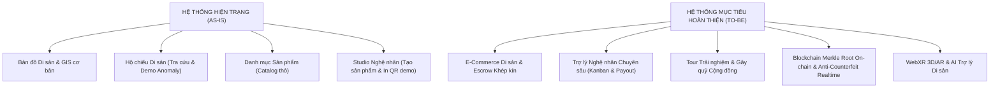
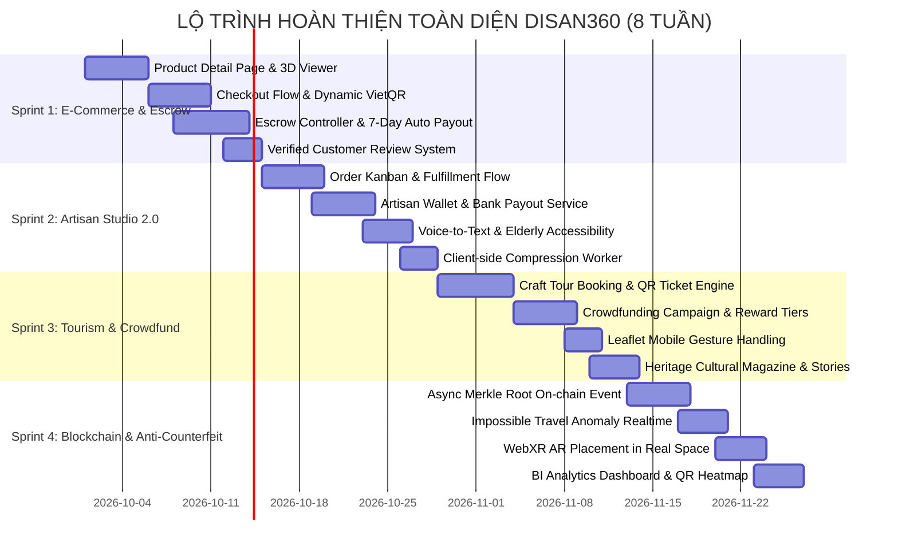
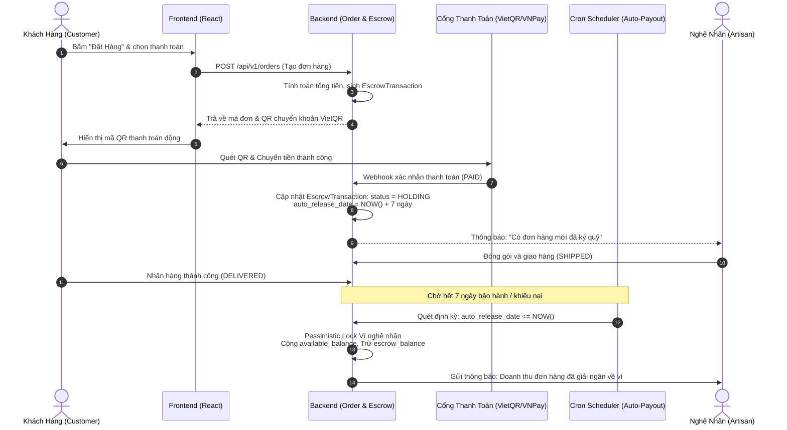

# KẾ HOẠCH TỔNG THỂ & LỘ TRÌNH HOÀN THIỆN SẢN PHẨM (PRODUCT COMPLETION MASTER PLAN)
## DỰ ÁN: NỀN TẢNG SỐ HÓA DI SẢN VĂN HÓA & E-COMMERCE LÀNG NGHỀ (DISAN360)
* **Vị trí thiết kế:** Kiến trúc sư Trưởng Phần mềm & Thiết kế Trải nghiệm Sản phẩm (Principal Software Architect & Lead Product Designer)
* **Phiên bản tài liệu:** v2.0-RELEASE-CANDIDATE
* **Thời gian lập kế hoạch:** Tháng 10/2026
* **Hệ sinh thái công nghệ:** React 18/19, TypeScript, Zustand (Immer), TanStack Query, Spring Boot 3.x, Spring Security 6, PostgreSQL/PostGIS, Web3j, Docker, MinIO.

---

## MỤC LỤC
1. [TỔNG QUAN DỰ ÁN & ĐÁNH GIÁ CHÊNH LỆCH HIỆN TRẠNG (GAP ANALYSIS)](#1-tổng-quan-dự-án--đánh-giá-chênh-lệch-hiện-trạng-gap-analysis)
2. [LỘ TRÌNH THỰC THI THEO SPRINT (ACTIONABLE SPRINT ROADMAP)](#2-lộ-trình-thực-thi-theo-sprint-actionable-sprint-roadmap)
   * [Sprint 1: Thương Mại Điện Tử Di Sản, Giỏ Hàng & Ký Quỹ Escrow](#sprint-1-thương-mại-điện-tử-di-sản-giỏ-hàng--ký-quỹ-escrow)
   * [Sprint 2: Kênh Nghệ Nhân Chuyên Sâu, Trợ Năng & Quản Trị Kho Vận](#sprint-2-kênh-nghệ-nhân-chuyên-sâu-trợ-năng--quản-trị-kho-vận)
   * [Sprint 3: Du Lịch Trải Nghiệm Làng Nghề & Gây Quỹ Cộng Đồng](#sprint-3-du-lịch-trải-nghiệm-làng-nghề--gây-quỹ-cộng-đồng)
   * [Sprint 4: Blockchain On-Chain, Chống Giả Nâng Cao & BI Analytics](#sprint-4-blockchain-on-chain-chống-giả-nâng-cao--bi-analytics)
3. [THIẾT KẾ KIẾN TRÚC VÀ ĐẶC TẢ KỸ THUẬT MỞ RỘNG (TECHNICAL SPECIFICATIONS)](#3-thiết-kế-kiến-trúc-và-đặc-tả-kỹ-thuật-mở-rộng-technical-specifications)
4. [MA TRẬN ƯU TIÊN TÍNH NĂNG (MOSCOW MATRIX) & PHÂN BỔ NGUỒN LỰC](#4-ma-trận-ưu-tiên-tính-năng-moscow-matrix--phân-bổ-nguồn-lực)
5. [QUY TRÌNH KIỂM SOÁT CHẤT LƯỢNG (QUALITY GATES) & QUẢN TRỊ RỦI RO](#5-quy-trình-kiểm-soát-chất-lượng-quality-gates--quản-trị-rủi-ro)

---

## 1. TỔNG QUAN DỰ ÁN & ĐÁNH GIÁ CHÊNH LỆCH HIỆN TRẠNG (GAP ANALYSIS)

### 1.1. Tầm nhìn Sản phẩm (Product Vision)
DiSan360 là hệ sinh thái số hóa toàn diện kết nối giữa **Di sản Văn hóa Phi vật thể/Vật thể**, **Nghệ nhân Làng nghề**, và **Người tiêu dùng / Du khách trong & ngoài nước**. Hệ thống giải quyết 3 điểm nghẽn cốt tử của làng nghề truyền thống Việt Nam:
1. **Nạn hàng giả, hàng nhái mỹ nghệ:** Giải quyết bằng Hộ chiếu Di sản Số (Digital Heritage Passport) định danh độc bản vật lý-số qua chip NFC/QR Code đối chiếu băm bất biến trên Blockchain.
2. **Thiếu niềm tin giao dịch giá trị cao:** Giải quyết bằng cơ chế Ký quỹ Thanh toán (Escrow Protection Engine) bảo vệ cả người mua và nghệ nhân.
3. **Nguy cơ mai một bí quyết làng nghề:** Giải quyết bằng Bản đồ GIS Làng nghề, Tour trải nghiệm thực tế và Gây quỹ cộng đồng (Crowdfunding) bảo tồn kỹ nghệ cổ truyền.

---

### 1.2. Ma trận Đối soát Hiện trạng (AS-IS) và Mục tiêu Hoàn thiện (TO-BE)



| Phân hệ (Module) | Hiện trạng đã có (AS-IS) | Khoảng cách cần hoàn thiện (GAP) | Trạng thái Mục tiêu (TO-BE) | Mức độ ưu tiên |
| :--- | :--- | :--- | :--- | :---: |
| **1. Hộ chiếu Di sản (Passport)** | • Tra cứu Passport công khai qua mã.<br>• Quét QR qua Camera / Upload ảnh.<br>• Xuất tem QR in nhiệt.<br>• Kính lúp soi chi tiết vân tác phẩm.<br>• Giả lập kiểm tra anomaly tốc độ di chuyển. | • Chưa tích hợp Web NFC API ghi chip vật lý NTAG213 trực tiếp.<br>• Chưa sinh PDF Chứng chỉ Di sản A4 có ký số phía Backend.<br>• Cảnh báo anomaly chưa tự động gửi cảnh báo đẩy/email tới Hội đồng làng. | Hộ chiếu di sản số chuẩn NFT-Twin, tích hợp NFC Web API, cấp chứng chỉ PDF chuẩn A4, tự động hóa khóa tem khi bị quét phân tán bất thường. | **P0 (Cực cao)** |
| **2. Thương mại Điện tử (E-Commerce)** | • Trang Catalog hiển thị danh sách.<br>• Lọc theo danh mục cơ bản.<br>• Thêm vào giỏ hàng cục bộ (Zustand). | • Thiếu trang Chi tiết Tác phẩm tương tác 3D xoay 360°.<br>• Thiếu luồng Thanh toán (Checkout Flow) đa phương thức (VietQR dynamic, VNPay/MoMo).<br>• Chưa có giao diện & API Custom Commission (Đặt chế tác riêng).<br>• Chưa có Đánh giá có xác thực (Verified Review). | Sàn TMĐT thủ công mỹ nghệ cao cấp, thanh toán an toàn, minh bạch tiến độ chế tác theo yêu cầu, đánh giá gắn chặt với mã đơn hoàn tất. | **P0 (Cực cao)** |
| **3. Ký quỹ Thanh toán (Escrow)** | • Entity `Order`, `OrderItem`, `EscrowTransaction` và `EscrowService` ở tầng backend. | • Chưa có REST Controller tiếp nhận và điều phối luồng Ký quỹ.<br>• Chưa có cơ chế giải ngân tự động sau 7 ngày (Scheduled Cron Worker).<br>• Chưa có quy trình mở Khiếu nại/Tranh chấp và Hoàn tiền (Dispute & Refund Flow). | Hệ thống ví ký quỹ tự động giải ngân sau $N$ ngày nhận hàng, bảo vệ 100% dòng tiền giao dịch tác phẩm độc bản. | **P0 (Cực cao)** |
| **4. Kênh Nghệ nhân (Artisan Studio)** | • Giao diện Dashboard cơ bản.<br>• Modal tạo tác phẩm và sinh passport.<br>• Prototype nhập liệu giọng nói (Web Speech API). | • Chưa có bảng Kanban quản lý đơn đặt hàng & quy trình đóng gói.<br>• Chưa có phân hệ Ví nghệ nhân & Yêu cầu rút tiền về ngân hàng.<br>• Tối ưu hóa UI/UX trợ năng (Elderly-Friendly AAA) cho nghệ nhân cao tuổi chưa triệt để. | Studio chuyên dụng cho nghệ nhân: Font $\ge 16\text{px}$, nút $\ge 48\text{px}$, Kanban đơn giản 3 cột, rút tiền 1 chạm, trợ lý giọng nói chuẩn hóa. | **P1 (Cao)** |
| **5. Du lịch & Bảo tồn (Preservation & Tourism)** | • Bản đồ số Leaflet hiển thị các làng nghề.<br>• Modal thêm vị trí & đề xuất tọa độ GIS. | • Hoàn toàn chưa có Module Đặt Tour trải nghiệm thực tế (Booking, Slotting, Vé QR).<br>• Hoàn toàn chưa có Module Gây quỹ Cộng đồng (Crowdfunding, Tiers đóng góp, Tiến độ mốc vốn).<br>• Chưa có trang Tạp chí Di sản & Blog văn hóa nghệ nhân. | Cổng kết nối bảo tồn: Đặt tour trải nghiệm làm gốm/dệt lụa có vé điện tử QR, chiến dịch gây quỹ phục dựng kỹ nghệ cổ truyền. | **P1 (Cao)** |
| **6. Chuỗi khối & Quản trị (Admin & Web3)** | • Dashboard Làng nghề duyệt lô batch passport.<br>• Dashboard SuperAdmin duyệt làng nghề.<br>• Băm SHA-256 đối chiếu client/mock hash. | • Gom Merkle Root của lô sản phẩm chưa gửi lên Smart Contract thật trên mạng testnet/mainnet.<br>• Chưa có Dashboard giám sát sổ cái Blockchain Ledger và Gas Pool.<br>• Chưa có BI Analytics tổng hợp xu hướng thị trường và Heatmap quét QR toàn cầu. | Trung tâm quản trị toàn diện: Tự động gom Merkle Root đẩy On-Chain `@Async`, quản lý doanh thu hoa hồng, phân tích luồng quét chống giả theo địa lý. | **P2 (Trung bình)** |

---

## 2. LỘ TRÌNH THỰC THI THEO SPRINT (ACTIONABLE SPRINT ROADMAP)

Lộ trình được cấu trúc thành **4 Sprint chuyên sâu (tổng thời gian 8 tuần)**, mỗi Sprint tập trung giải quyết trọn vẹn một trụ cột tính năng, tuân thủ nguyên tắc bàn giao lũy tiến (Incremental Delivery) và sẵn sàng Release.



---

### SPRINT 1: THƯƠNG MẠI ĐIỆN TỬ DI SẢN, GIỎ HÀNG & KÝ QUỸ ESCROW
**Thời gian:** Tuần 1 - Tuần 2  
**Mục tiêu cốt lõi:** Biến nền tảng thành một sàn giao dịch tác phẩm di sản thực thụ, có cơ chế giỏ hàng, đặt hàng, thanh toán VietQR động và bảo hộ ký quỹ an toàn tuyệt đối.

#### 1. Các tác vụ Frontend (React + TypeScript + Zustand):
* [ ] **`ProductDetailPage.tsx` (Chi tiết tác phẩm):**
  * Bố cục Neo-Heritage chuẩn: Thư viện ảnh trượt, kính lúp soi chi tiết men/chất liệu, thông tin nghệ nhân chế tác kèm nút *"Ghé thăm xưởng"*.
  * Tích hợp thành phần xem mô hình 3D xoay $360^\circ$ (`ModelViewer.tsx`) với tương tác xoay, zoom, đổi chế độ ánh sáng.
  * Hiển thị Huy hiệu Hộ chiếu Di sản kèm mã định danh dự kiến và liên kết tra cứu nhanh.
* [ ] **`CartDrawer.tsx` & `CheckoutModal.tsx` (Giỏ hàng & Đặt hàng):**
  * Thiết kế Drawer giỏ hàng trượt mượt mà, cập nhật số lượng, kiểm tra tồn kho realtime.
  * Form thanh toán tuân thủ quy tắc nhập liệu: Tự động focus trường Họ tên, validate số điện thoại Việt Nam, dropdown địa chỉ hành chính 3 cấp (Tỉnh/Thành, Quận/Huyện, Phường/Xã).
  * Phương thức thanh toán: Chuyển khoản VietQR sinh mã QR động kèm số tiền và nội dung chuyển khoản tự động, thẻ tín dụng và COD (yêu cầu đặt cọc trước với tác phẩm độc bản).
* [ ] **`CustomCommissionModal.tsx` (Đặt chế tác tác phẩm theo yêu cầu):**
  * Form dành cho khách gửi yêu cầu đặt hàng độc bản (chọn chất liệu, kích thước mong muốn, tải lên bản vẽ/ảnh mẫu phác thảo).
  * Quy trình đàm phán giá và xác nhận đặt cọc 30% - 50% giữ qua Escrow.
* [ ] **`VerifiedReviewSection.tsx` (Đánh giá có xác thực):**
  * Chỉ mở quyền gửi bình luận và chấm điểm cho khách hàng đã có đơn hàng ở trạng thái `DELIVERED`.
  * Hiển thị nhãn xanh `"ĐÃ XÁC THỰC MUA HÀNG TẠI LÀNG NGHỀ"`.

#### 2. Các tác vụ Backend (Spring Boot 3.x + PostgreSQL):
* [ ] **Phát triển `OrderController.java` & DTOs:**
  * `POST /api/v1/orders`: Tạo mới đơn hàng, tự động sinh mã `order_code` theo chuẩn `VN-YYYYMMDD-XXXX`.
  * `GET /api/v1/orders/my-orders`: Lấy danh sách lịch sử mua hàng của khách hàng hiện tại (phân trang chuẩn `PagedResponse<OrderDto>`).
  * `PUT /api/v1/orders/{orderId}/cancel`: Hủy đơn hàng trước khi nghệ nhân xuất kho đóng gói.
* [ ] **Xây dựng `EscrowController.java` & Hoàn thiện `EscrowService.java`:**
  * `POST /api/v1/escrow/{orderId}/deposit`: Ghi nhận tiền cọc/thanh toán thành công vào tài khoản ký quỹ.
  * `POST /api/v1/escrow/{orderId}/release`: Giải ngân dòng tiền về ví khả dụng của nghệ nhân (`available_balance`).
  * `POST /api/v1/escrow/{orderId}/dispute`: Khách hàng kích hoạt tranh chấp khi tác phẩm bị nứt vỡ, sai lệch mô tả; tạm dừng bộ đếm thời gian tự động giải ngân.
* [ ] **Scheduled Worker Tự động Giải Ngân (`EscrowScheduler.java`):**
  * Sử dụng `@Scheduled(cron = "0 0 1 * * ?")` (chạy vào 01:00 sáng mỗi ngày) quét các giao dịch ký quỹ có `auto_release_date <= NOW()` và `status = 'HOLDING'`.
  * Tự động giải ngân sang số dư ví nghệ nhân và gửi email/thông báo thông tin đến nghệ nhân.
  * Sử dụng `@Lock(LockModeType.PESSIMISTIC_WRITE)` khi cộng trừ số dư ví để chống triệt để Race Condition.

---

### SPRINT 2: KÊNH NGHỆ NHÂN CHUYÊN SÂU, TRỢ NĂNG & QUẢN TRỊ KHO VẬN
**Thời gian:** Tuần 3 - Tuần 4  
**Mục tiêu cốt lõi:** Trao quyền tối đa cho nghệ nhân (kể cả nghệ nhân cao tuổi) tự vận hành xưởng, theo dõi đơn hàng, quản trị tồn kho và rút tiền doanh thu nhanh chóng.

#### 1. Các tác vụ Frontend (Artisan Accessibility UX):
* [ ] **Kanban Quản lý Đơn Hàng (`ArtisanOrderKanban.tsx`):**
  * Bảng điều khiển trực quan 4 cột: `Chờ Chuẩn Bị` $\to$ `Đang Chế Tác` $\to$ `Đã Đóng Gói / Chờ Giao` $\to$ `Giao Thành Công`.
  * Mỗi thẻ đơn hiển thị to rõ thông tin sản phẩm, địa chỉ người nhận, ghi chú đặc biệt của khách hàng.
  * Hỗ trợ kéo thả (Drag & Drop) hoặc bấm nút to bản $\ge 48\text{px}$ để chuyển trạng thái.
* [ ] **Giao diện Ví Nghệ Nhân & Rút Tiền (`ArtisanWalletModal.tsx`):**
  * Hiển thị rạch ròi 2 mục số dư:
    1. **Số dư Khả dụng (Available Balance):** Có thể rút ngay.
    2. **Số dư Đang Ký Quỹ (Escrow Balance):** Tiền của các đơn hàng đang trong thời hạn bảo hành 7 ngày.
  * Nút `"RÚT TIỀN VỀ NGÂN HÀNG"` lớn, mở modal nhập số tiền muốn rút và chọn tài khoản ngân hàng thụ hưởng đã liên kết (hỗ trợ lưu tài khoản VietQR).
* [ ] **Hoàn thiện Trợ lý Nhập liệu Giọng nói (`VoiceInputAssistant.tsx`):**
  * Ứng dụng Web Speech Recognition API với ngôn ngữ `vi-VN`.
  * Tự động nhận diện các trường cơ bản: Tên tác phẩm, Dòng men/Gỗ, Kích thước, Giá tiền khi nghệ nhân nói.
  * Cung cấp phản hồi âm thanh hoặc rung nhẹ (Haptic Feedback) khi bắt đầu và kết thúc thu âm.
* [ ] **Client-side Image Compressor (`imageCompressor.ts`):**
  * Bắt buộc tích hợp vào toàn bộ các input chụp ảnh camera (`capture="environment"`).
  * Nén ảnh qua Canvas/OffscreenCanvas về độ phân giải tối đa $1920\text{px}$, chất lượng $80\%$ WebP/JPEG, bảo đảm dung lượng file luôn $\le 1.5\text{MB}$ trước khi gọi API `POST /api/v1/storage/upload`.

#### 2. Các tác vụ Backend:
* [ ] **`ArtisanOrderController.java`:**
  * `GET /api/v1/artisan/orders`: Danh sách đơn đặt các tác phẩm thuộc sở hữu của nghệ nhân.
  * `PUT /api/v1/artisan/orders/{orderId}/status`: Cập nhật tiến độ hoàn thành đơn.
  * `POST /api/v1/artisan/orders/{orderId}/shipping-label`: Sinh mã vận đơn và file in tem gửi hàng.
* [ ] **`ArtisanPayoutService.java` & `ArtisanWalletController.java`:**
  * `POST /api/v1/artisan/wallet/withdraw`: Tạo yêu cầu rút tiền với kiểm tra số dư khả dụng nghiêm ngặt (`compareTo` qua `BigDecimal`).
  * Ghi nhận lịch sử giao dịch vào bảng `wallet_transactions` để phục vụ đối soát thuế và kế toán.

---

### SPRINT 3: DU LỊCH TRẢI NGHIỆM LÀNG NGHỀ & GÂY QUỸ CỘNG ĐỒNG
**Thời gian:** Tuần 5 - Tuần 6  
**Mục tiêu cốt lõi:** Mở rộng trải nghiệm từ sản phẩm vật lý sang dịch vụ du lịch văn hóa và phong trào chung tay bảo tồn các làng nghề truyền thống.

#### 1. Các tác vụ Frontend:
* [ ] **Trang Đặt Tour Trải Nghiệm Làng Nghề (`TourBookingPage.tsx`):**
  * Danh sách tour trải nghiệm thực tế: "Học vuốt gốm Bát Tràng cùng Nghệ nhân Ưu tú", "Trải nghiệm nhuộm chàm Dệt thổ cẩm Tả Phìn", "Đúc đồng truyền thống Ngũ Xã".
  * Chọn lịch trực quan theo khung ngày và slot giờ (Sáng / Chiều).
  * Modal thanh toán và xuất **Vé Điện Tử QR Code (E-Ticket)** để check-in tại cổng làng hoặc xưởng nghề.
* [ ] **Trang Gây Quỹ Cộng Đồng Bảo Tồn (`CrowdfundCampaignPage.tsx`):**
  * Giới thiệu các dự án phục dựng kỹ nghệ đang có nguy cơ thất truyền (ví dụ: Phục chế màu men tro cổ thời Lý, Phục dựng tranh lụa thủ công dệt bằng tơ sen).
  * Thanh tiến độ gây quỹ thời gian thực (Hiển thị tỷ lệ đạt được $\%$, số tiền đã quyên góp, số ngày còn lại).
  * Danh sách các gói tài trợ (Reward Tiers): Đóng góp từ $100.000\text{ đ}$ nhận thiệp cảm ơn có chữ ký nghệ nhân; đóng góp từ $2.000.000\text{ đ}$ nhận tác phẩm phiên bản tri ân giới hạn.
* [ ] **Tối ưu Bản Đồ Leaflet trên Thiết Bị Di Động (`HeritageMap.tsx`):**
  * Kích hoạt `gestureHandling: true` hoặc chặn single-touch drag trên mobile: Yêu cầu người dùng vuốt bằng 2 ngón tay để di chuyển bản đồ.
  * Hiển thị tooltip chỉ dẫn phong cách Neo-Heritage: *"Dùng 2 ngón tay để di chuyển bản đồ"*, ngăn ngừa triệt để lỗi người dùng bị kẹt cuộn trang web khi lướt ngón tay qua khu vực bản đồ.

#### 2. Các tác vụ Backend:
* [ ] **`TourController.java` & `TourBookingController.java`:**
  * Quản lý thông tin tour, lịch mở theo ngày và sức chứa tối đa mỗi slot.
  * Sinh mã băm vé độc bản `ticket_qr_code` mã hóa thông tin: `booking_id + user_id + date + salt`.
  * Endpoint soát vé: `POST /api/v1/tours/verify-ticket` dành cho người quản lý xưởng quét vé khách tham quan.
* [ ] **`CrowdfundController.java`:**
  * Lấy danh sách các chiến dịch gây quỹ đang hoạt động.
  * `POST /api/v1/crowdfunding/{campaignId}/donate`: Tiếp nhận đóng góp qua cổng thanh toán, tự động cập nhật số tiền `current_amount`.
  * Phòng ngừa lỗi chia cho 0 khi tính tỷ lệ hoàn thành chiến dịch theo quy chuẩn hệ thống.

---

### SPRINT 4: BLOCKCHAIN ON-CHAIN, CHỐNG GIẢ NÂNG CAO & BI ANALYTICS
**Thời gian:** Tuần 7 - Tuần 8  
**Mục tiêu cốt lõi:** Đảm bảo tính pháp lý, tính bất biến sổ cái toàn vẹn, hoàn thiện công nghệ thực tế ảo WebXR và cung cấp số liệu phân tích chuyên sâu cho ban quản lý.

#### 1. Các tác vụ Frontend:
* [ ] **Thực Tế Ảo WebXR / AR Đặt Hiện Vật (`WebXrArViewer.tsx`):**
  * Cho phép người dùng bấm nút *"Xem thử trong không gian phòng khách của bạn"*.
  * Tự động nhận diện mặt sàn thực tế qua Camera điện thoại và đặt mô hình bình gốm/tượng gỗ với tỉ lệ kích thước thật ($1:1$).
  * Hỗ trợ xuất file định dạng `.usdz` cho iOS (Apple AR Quick Look) và Scene Viewer cho Android.
* [ ] **Dashboard Phân Tích Dữ Liệu Làng Nghề (`VillageBiDashboard.tsx`):**
  * Biểu đồ doanh thu lũy kế theo từng dòng chất liệu sản phẩm.
  * Bản đồ nhiệt (Heatmap) thể hiện phân bố địa lý các lượt quét QR Hộ chiếu di sản trên toàn thế giới (nhận diện thị trường khách quốc tế tiềm năng).
  * Thống kê các cảnh báo quét trùng lặp / bất thường cần can thiệp.

#### 2. Các tác vụ Backend:
* [ ] **Xử lý Bất Đồng Bộ Merkle Root & Blockchain Event Publisher:**
  * Khi Trưởng làng phê duyệt mẻ xuất xưởng (`PUT /api/v1/villages/batches/{batchId}/review`):
    * Tính cây băm Merkle Root của toàn bộ danh sách `verification_hash` trong lô hàng.
    * Kích hoạt sự kiện bất đồng bộ qua Spring `ApplicationEventPublisher`.
    * Service `@Async` đảm nhận việc gọi Web3j gửi Transaction chứa `merkle_root` lên Smart Contract (Polygon POS / Chuỗi khối Di sản) và lưu `blockchain_tx_hash`.
    * API phản hồi ngay lập tức `HTTP 200/202` cho client trong vòng $< 300\text{ms}$, tuyệt đối không chặn luồng chờ blockchain đào block.
* [ ] **Nâng Cấp Thuật Toán Chống Hàng Giả Realtime (`AntiCounterfeitEngine.java`):**
  * Bắt sự kiện quét mã từ `PassportPublicController`.
  * Áp dụng công thức Haversine tính vận tốc di chuyển giữa 2 lần quét gần nhất:
    $$V = \frac{D\text{ (km)}}{\Delta t\text{ (giờ)}}$$
  * Kích hoạt cờ `FLAGGED_ANOMALY` nếu $V > 900\text{ km/h}$ hoặc $D > 100\text{ km}$ trong thời gian $\Delta t < 5\text{ phút}$.
  * Tự động gửi cảnh báo khẩn cấp tới email Quản lý làng nghề và đổi nhãn cảnh báo đỏ trên trang tra cứu của người quét.
* [ ] **Bộ Đệm & Chặn Quét Brute-Force (Rate Limiter):**
  * Cấu hình Bucket4j giới hạn 60 requests/phút trên mỗi địa chỉ IP đối với endpoint tra cứu công khai `/api/v1/public/passports/{code}`.

---

## 3. THIẾT KẾ KIẾN TRÚC VÀ ĐẶC TẢ KỸ THUẬT MỞ RỘNG (TECHNICAL SPECIFICATIONS)

### 3.1. Luồng Thanh toán và Ký quỹ Khép kín (Escrow Architecture Flow)



---

### 3.2. Cấu trúc Bảng Cơ sở Dữ liệu Mở rộng (Extended DDL)

Để hỗ trợ đầy đủ các phân hệ mới của Sprint 1, 2, 3, bổ sung kịch bản di chuyển cơ sở dữ liệu (`V2__extended_features.sql`):

```sql
-- ========================================================
-- 1. BẢNG ĐÁNH GIÁ TÁC PHẨM CÓ XÁC THỰC
-- ========================================================
CREATE TABLE product_reviews (
    id BIGSERIAL PRIMARY KEY,
    product_id BIGINT NOT NULL REFERENCES products(id),
    order_id BIGINT NOT NULL REFERENCES orders(id),
    customer_id BIGINT NOT NULL REFERENCES users(id),
    rating INT NOT NULL CHECK (rating >= 1 AND rating <= 5),
    comment TEXT NOT NULL,
    media_urls TEXT[],                                  -- Ảnh/Video khách hàng đính kèm
    is_verified_purchase BOOLEAN DEFAULT TRUE,
    is_hidden BOOLEAN DEFAULT FALSE,
    created_at TIMESTAMP WITH TIME ZONE DEFAULT CURRENT_TIMESTAMP,
    CONSTRAINT uq_order_product_review UNIQUE (order_id, product_id)
);

-- ========================================================
-- 2. BẢNG GIAO DỊCH VÍ NGHỆ NHÂN (WALLET AUDIT)
-- ========================================================
CREATE TABLE artisan_wallet_transactions (
    id BIGSERIAL PRIMARY KEY,
    artisan_id BIGINT NOT NULL REFERENCES artisan_profiles(id),
    transaction_type VARCHAR(30) NOT NULL,              -- ESCROW_RELEASE, WITHDRAWAL, REFUND_DEDUCT
    amount NUMERIC(15,2) NOT NULL,
    balance_before NUMERIC(15,2) NOT NULL,
    balance_after NUMERIC(15,2) NOT NULL,
    reference_id VARCHAR(100),                          -- Mã đơn hàng hoặc mã rút tiền ngân hàng
    note TEXT,
    created_at TIMESTAMP WITH TIME ZONE DEFAULT CURRENT_TIMESTAMP
);

-- ========================================================
-- 3. BẢNG CHIẾN DỊCH VÀ ĐÓNG GÓP GÂY QUỸ (CROWDFUNDING)
-- ========================================================
CREATE TABLE crowdfund_donations (
    id BIGSERIAL PRIMARY KEY,
    campaign_id BIGINT NOT NULL REFERENCES crowdfund_campaigns(id),
    donor_id BIGINT REFERENCES users(id),
    donor_name VARCHAR(150) NOT NULL,
    donor_email VARCHAR(150),
    amount NUMERIC(15,2) NOT NULL,
    is_anonymous BOOLEAN DEFAULT FALSE,
    message TEXT,
    reward_tier_id VARCHAR(50),
    payment_status VARCHAR(30) DEFAULT 'PAID',
    created_at TIMESTAMP WITH TIME ZONE DEFAULT CURRENT_TIMESTAMP
);
```

---

## 4. MA TRẬN ƯU TIÊN TÍNH NĂNG (MOSCOW MATRIX) & PHÂN BỔ NGUỒN LỰC

### 4.1. Phân loại theo Phương pháp MoSCoW

| Nhóm MoSCoW | Tính năng & Hạng mục kỹ thuật | Ràng buộc nghiệp vụ / Mục tiêu nghiệm thu |
| :--- | :--- | :--- |
| **MUST HAVE** *(Bắt buộc phải có)* | 1. Trang Chi tiết Tác phẩm kèm xem mô hình 3D.<br>2. Luồng Thanh toán Giỏ hàng tích hợp VietQR động.<br>3. Controller & Scheduler Ký quỹ Escrow (tự giải ngân sau 7 ngày).<br>4. Kanban Quản lý Đơn hàng cho Nghệ nhân.<br>5. Ví Nghệ nhân & Yêu cầu Rút tiền về Ngân hàng.<br>6. Nén ảnh tự động Client-side $\le 1.5\text{MB}$. | • Hệ thống vận hành trơn tru chu trình mua - bán - giao - nhận tiền.<br>• Tuân thủ nghiêm ngặt chuẩn tiền tệ `BigDecimal`, không lỗi chia cho 0.<br>• Phân định rõ ràng số dư ký quỹ và số dư khả dụng. |
| **SHOULD HAVE** *(Nên có để hoàn thiện)* | 1. Đặt Tour trải nghiệm làng nghề xuất vé điện tử QR.<br>2. Gây quỹ cộng đồng phục dựng làng nghề.<br>3. Thuật toán Chống giả Realtime (Impossible Travel Velocity).<br>4. Đồng bộ Merkle Root lên Blockchain dạng `@Async`.<br>5. Đánh giá tác phẩm có xác thực đơn hàng. | • Nâng tầm trải nghiệm bảo tồn văn hóa đa chiều.<br>• Phản hồi API review mẻ xuất xưởng trong vòng $< 300\text{ms}$.<br>• Cảnh báo hàng giả tự động bật cờ đỏ khi phát hiện gian lận. |
| **COULD HAVE** *(Có thể bổ sung nếu dư dả thời gian)* | 1. Tương tác WebXR AR đặt mô hình 3D trong phòng khách.<br>2. Tích hợp Web NFC API ghi thẻ trực tiếp từ trình duyệt.<br>3. Báo cáo BI Heatmap quét mã toàn cầu.<br>4. Sinh file PDF Chứng chỉ Di sản A4 chuẩn hóa. | • Điểm cộng công nghệ nổi bật khi báo cáo, trình diễn dự án.<br>• Cung cấp giá trị gia tăng trực quan cho khách hàng cao cấp. |
| **WON'T HAVE** *(Chưa làm trong giai đoạn này)* | 1. Cầu nối chuỗi chéo (Cross-chain Bridge) sang Ethereum Mainnet.<br>2. Đấu giá thời gian thực bằng Smart Contract tự động.<br>3. Ứng dụng Native iOS/Android (Tập trung toàn lực PWA/Web Responsive). | • Tạm hoãn để tối ưu hóa nguồn lực cho sản phẩm Web cốt lõi. |

---

### 4.2. Kế hoạch Phân bổ Nguồn lực Kỹ thuật (Resource Allocation)

* **01 Software Architect & Lead Fullstack:** Phụ trách thiết kế kiến trúc, review code, tích hợp Web3j Blockchain, bảo mật Escrow, và quản lý các cổng thanh toán.
* **01 Backend Engineer (Spring Boot & Database):** Hiện thực `OrderController`, `EscrowController`, `TourController`, `CrowdfundController`, xử lý Scheduler, khóa dữ liệu Pessimistic Lock, và tối ưu truy vấn JPA.
* **02 Frontend Engineers (React, TypeScript & 3D):**
  * *FE Engineer 1:* Đảm nhiệm `ProductDetailPage`, Giỏ hàng, Luồng thanh toán Checkout, và Trợ lý Nghệ nhân Kanban/Ví tiền.
  * *FE Engineer 2:* Đảm nhiệm Tour trải nghiệm, Gây quỹ cộng đồng, WebXR AR, Trợ lý giọng nói, và tích hợp i18n/Accessibility.
* **01 QA/QC Automation & Manual Tester:** Viết kịch bản kiểm thử API (Postman/Newman), kiểm thử bảo mật chống giả, và kiểm thử giao diện trên các thiết bị di động thực tế.

---

## 5. QUY TRÌNH KIỂM SOÁT CHẤT LƯỢNG (QUALITY GATES) & QUẢN TRỊ RỦI RO

### 5.1. Bộ Quy Tắc Kiểm Định Bắt Buộc (Quality Gates Checklist)

Mọi Pull Request (PR) được đưa vào nhánh chính (`main`/`staging`) bắt buộc phải vượt qua các chốt chặn sau:

```
[ ] GATE 1: NGUYÊN TẮC FRONTEND & TRẢI NGHIỆM NEO-HERITAGE
    ├─ Tuyệt đối KHÔNG hard-code tiếng Việt trong JSX/TSX; 100% qua hàm translate()/t().
    ├─ Toàn bộ form có 2 nút bấm quy chuẩn: "LƯU DỮ LIỆU" và "THOÁT".
    ├─ Màu sắc tuân thủ: Nền Giấy Dó (#FBF9F5/#F0F2F5), Nhãn đen (#000000), Chữ nhập xanh (#1677ff/#1A365D).
    ├─ Nút thoát form kiểm tra tính nguyên vẹn: Hiển thị confirm nếu form bị dirty.
    ├─ Trường mã code: Chặn ký tự đặc biệt (chỉ A-Z, 0-9, _) và disable khi sửa.
    └─ Mobile Map có cấu hình Leaflet gestureHandling tránh kẹt vuộn trang.

[ ] GATE 2: TOÀN VẸN BACKEND & TÀI CHÍNH KÝ QUỸ
    ├─ Toàn bộ phép tính tiền tệ sử dụng BigDecimal với RoundingMode rõ ràng; cấm float/double.
    ├─ Kiểm tra triệt để điều kiện khác 0 trước mọi phép chia (Division by Zero Prevention).
    ├─ Thao tác cộng trừ số dư ví dùng Pessimistic Lock (@Lock(PESSIMISTIC_WRITE)).
    ├─ Không sử dụng FetchType.EAGER trên Collection; sử dụng @EntityGraph hoặc JOIN FETCH.
    └─ Các tác vụ Blockchain / Merkle Root bắt buộc bọc trong @Async Service.

[ ] GATE 3: BẢO MẬT & THÔNG BÁO HỆ THỐNG
    ├─ Tiêu đề của toàn bộ Popup/Hộp thoại cảnh báo đồng nhất là "BHTT".
    ├─ Endpoint tra cứu mã QR có gắn Rate Limiting (60 req/phút).
    └─ Thuật toán phát hiện di chuyển bất thường (Impossible Travel Velocity) hoạt động chính xác.
```

---

### 5.2. Ma trận Quản trị Rủi ro (Risk Mitigation Matrix)

| Mã Rủi ro | Nguy cơ tiềm ẩn | Mức độ tác động | Xác suất xảy ra | Phương án phòng ngừa & Xử lý sự cố |
| :---: | :--- | :---: | :---: | :--- |
| **RSK-01** | **Nghẽn mạng Blockchain:** Việc chờ xác nhận block làm treo API phê duyệt mẻ sản phẩm của quản lý làng. | **Nghiêm trọng (High)** | Trung bình | Tách rời hoàn toàn luồng ghi nhận nghiệp vụ và luồng đẩy On-Chain qua mô hình Spring `@Async` + `ApplicationEventPublisher`. Phản hồi ngay HTTP 200/202 cho người dùng. |
| **RSK-02** | **Race Condition số dư ví:** Nghệ nhân gửi nhiều yêu cầu rút tiền đồng thời dẫn đến số dư bị âm. | **Nghiêm trọng (High)** | Thấp | Áp dụng Pessimistic Lock (`PESSIMISTIC_WRITE`) trên hàng bản ghi `artisan_profiles` trong cùng Transaction của cơ sở dữ liệu. |
| **RSK-03** | **Ảnh tải lên quá nặng làm sập băng thông di động:** Nghệ nhân dùng điện thoại đời mới chụp ảnh raw $8\text{MB} - 12\text{MB}$. | **Trung bình (Medium)** | Cao | Ép buộc nén ảnh tại Client (`imageCompressor.ts` qua Web Worker) về $\le 1.5\text{MB}$ trước khi kích hoạt request upload lên MinIO/S3. |
| **RSK-04** | **Kẹt cuộn trang trên màn hình cảm ứng:** Người dùng chạm ngón tay vào bản đồ Leaflet không thể cuộn xuống xem sản phẩm. | **Trung bình (Medium)** | Rất cao | Tích hợp tính năng cử chỉ 2 ngón (`gestureHandling: true`) trên toàn bộ các trang hiển thị bản đồ di động. |
| **RSK-05** | **Quét QR Hộ chiếu giả mạo phân tán:** Đối tượng xấu in hàng loạt mã QR hợp lệ dán lên sản phẩm giả mạo tại các địa phương khác. | **Nghiêm trọng (High)** | Trung bình | Thuật toán Impossible Travel Velocity tự động nhận diện nếu cùng mã quét ở 2 tọa độ cách xa $> 100\text{ km}$ trong $< 5$ phút, tự động chuyển trạng thái Hộ chiếu sang `FLAGGED_ANOMALY` và phát cảnh báo đỏ. |

---

## 6. KẾT LUẬN & KHUYẾN NGHỊ THIẾT KẾ

Bản kế hoạch trên cung cấp bức tranh chiến lược và giải pháp kỹ thuật chi tiết nhất để đưa sản phẩm **DiSan360** từ phiên bản hiện tại vươn lên thành một nền tảng chuyển đổi số di sản văn hóa và thương mại điện tử làng nghề đẳng cấp quốc gia. 

**Khuyến nghị thực thi ngay lập tức:**
1. Khởi động **Sprint 1** ngay hôm nay: Tập trung vào `ProductDetailPage` kết hợp 3D Viewer và luồng Thanh toán Escrow để thông luồng kinh doanh cốt lõi.
2. Thiết lập quy chuẩn kiểm soát Pull Request theo checklist **Quality Gates** tại mục 5.1 để đảm bảo mã nguồn mới luôn đáp ứng triệt để Bộ Quy Tắc Phát Triển Toàn Cục.

---
*Tài liệu được thiết kế và phê duyệt bởi: **Kiến trúc sư Trưởng Phần mềm & Thiết kế Sản phẩm - DiSan360**.*
