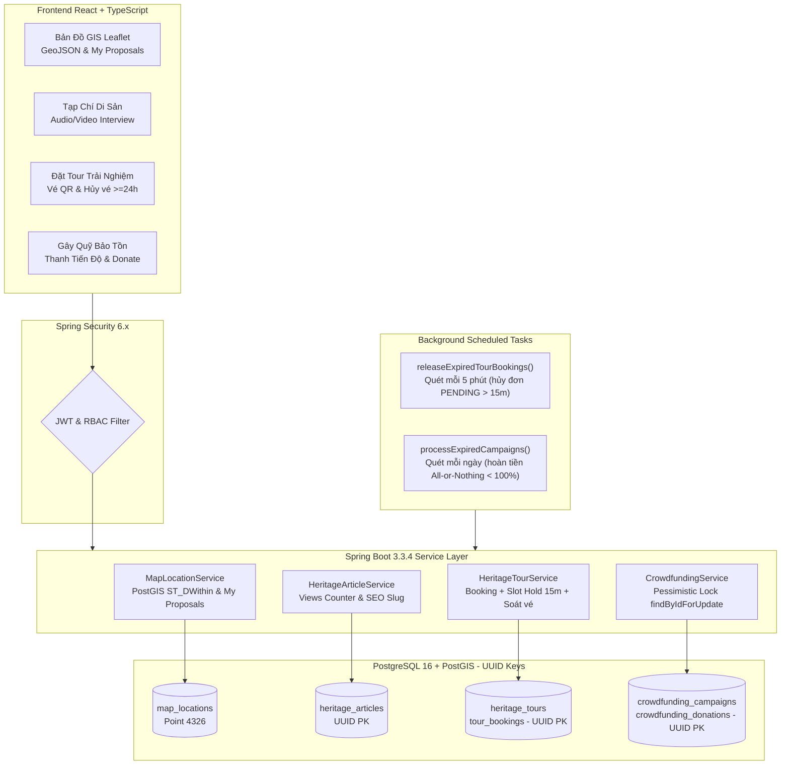
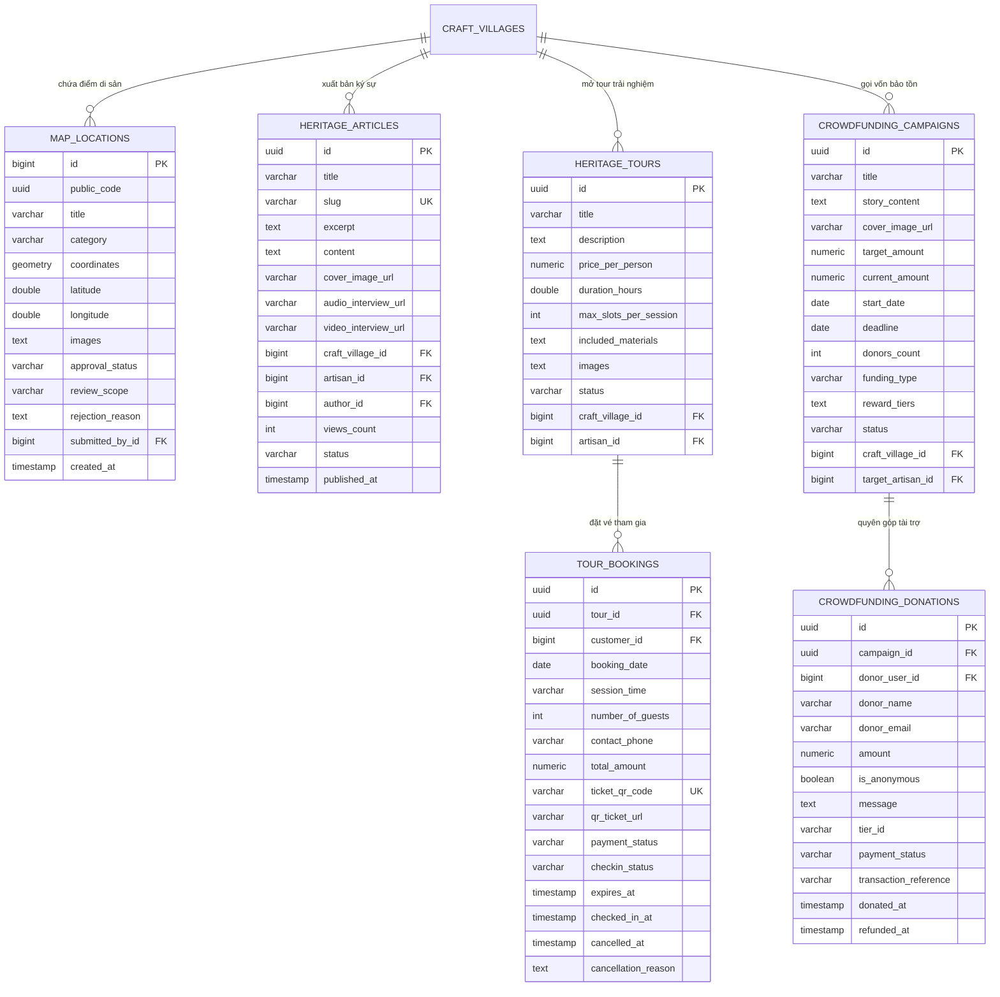

# KẾ HOẠCH TRIỂN KHAI CHI TIẾT (BẢN V2): PHÂN HỆ 4 - CỘNG ĐỒNG & BẢO TỒN

> **Mục tiêu**: Hiện thực hóa kiến trúc Backend (Spring Boot 3.3.4, PostGIS, UUID, Scheduled Workers) và Frontend cho 4 trụ cột:
> 1. **Bản đồ số GIS Làng nghề** (Heritage GIS Map, GeoJSON, My Proposals)
> 2. **Blog / Tạp chí văn hóa di sản** (Heritage Stories, Audio/Video Podcast)
> 3. **Tour trải nghiệm & Soát vé QR** (Booking, 15m Slot Holding Worker, Cancel/Refund $\ge 24\text{h}$)
> 4. **Gây quỹ cộng đồng bảo tồn** (Pessimistic Lock, All-or-Nothing vs Flexible, Refund Worker)

---

## I. KIẾN TRÚC TỔNG THỂ & RÀNG BUỘC KỸ THUẬT NÂNG CAO



### 5 Nguyên Tắc Kỹ Thuật Đã Tinh Chỉnh & Hoàn Thiện:
1. **Đồng bộ Kiểu dữ liệu Khóa chính (UUID Consistency)**:
   * Toàn bộ Entity mới (`HeritageArticle`, `HeritageTour`, `TourBooking`, `CrowdfundingCampaign`, `CrowdfundingDonation`) sử dụng chuẩn `UUID` cho Primary Key:
     ```java
     @Id
     @GeneratedValue(strategy = GenerationType.UUID)
     private UUID id;
     ```
   * Phương thức khóa bi-quan Repository: `Optional<CrowdfundingCampaign> findByIdForUpdate(@Param("id") UUID id);`.
2. **Cơ chế "Giữ chỗ tạm thời" 15 Phút & Thu hồi Vé Ảo**:
   * Bổ sung trường `expires_at TIMESTAMP` cho bản ghi đặt vé (`tour_bookings`).
   * Khi khách bấm đặt chỗ, `expires_at = Instant.now().plus(15, ChronoUnit.MINUTES)`.
   * Dung lượng chỗ còn trống tính trên các đơn `PAID` và các đơn `PENDING` chưa hết hạn:
     $$\text{OccupiedSlots} = \sum_{\text{PAID}} \text{guests} + \sum_{\text{PENDING} \land \text{expires\_at} > \text{NOW()}} \text{guests}$$
   * Worker ngầm `@Scheduled(cron = "0 */5 * * * ?")` tự động giải phóng chỗ cho các đơn quá hạn:
     ```java
     @Scheduled(cron = "0 */5 * * * ?")
     public void releaseExpiredTourBookings() {
         tourBookingRepository.expirePendingBookings(Instant.now());
     }
     ```
3. **Quy tắc Hủy vé & Hoàn tiền ($\ge 24\text{ giờ}$)**:
   * Bổ sung API `PUT /api/v1/tours/bookings/{bookingId}/cancel`.
   * Ràng buộc nghiệp vụ: Chỉ cho phép hủy nếu $\text{TourSessionStartTime} - \text{CurrentTime} \ge 24\text{ giờ}$.
   * Tự động hoàn lại số chỗ trống cho cộng đồng và cập nhật `payment_status = 'REFUNDED'`.
4. **Cơ chế Gây quỹ All-or-Nothing vs. Flexible & Hoàn tiền Tự động**:
   * Thêm trường `funding_type VARCHAR(20) DEFAULT 'ALL_OR_NOTHING'` (`ALL_OR_NOTHING` | `FLEXIBLE`).
   * Scheduled Worker quét các chiến dịch quá hạn (`deadline < CURRENT_DATE` và `status = 'ACTIVE'`):
     * Nếu `funding_type == 'ALL_OR_NOTHING'` và `current_amount < target_amount`:
       * Đổi trạng thái chiến dịch thành `FAILED`.
       * Kích hoạt hoàn tiền tự động cho tất cả nhà hảo tâm: `crowdfunding_donations.payment_status = 'REFUNDED'`.
     * Nếu đạt $\ge 100\%$ hoặc là mô hình `FLEXIBLE`: Đổi trạng thái sang `COMPLETED` để giải ngân cho làng nghề/nghệ nhân.
5. **Theo dõi Lịch sử Điểm Đề xuất của User (`My Proposed Locations`)**:
   * Bổ sung API `GET /api/v1/map/locations/my-proposals` dành riêng cho người dùng xem trạng thái (`PENDING`, `APPROVED`, `REJECTED`) và lý do từ chối (`rejection_reason`) của các điểm check-in di sản họ đã gửi lên.

---

## II. THIẾT KẾ ENTITIES & DATABASE SCHEMA (UUID & SCHEDULING ENRICHED)



---

## III. KẾ HOẠCH TRIỂN KHAI THEO 7 GIAI ĐOẠN

### Giai Đoạn 1: CSDL, UUID Entities & Repositories
1. Xây dựng 5 Entity mới với `@Id @GeneratedValue(strategy = GenerationType.UUID) private UUID id`:
   - `HeritageArticle.java`
   - `HeritageTour.java`
   - `TourBooking.java` (kèm `expiresAt`, `cancelledAt`, `cancellationReason`)
   - `CrowdfundingCampaign.java` (kèm `fundingType`, `donorsCount`)
   - `CrowdfundingDonation.java` (kèm `refundedAt`)
2. Nâng cấp `MapLocation.java` hỗ trợ tra cứu lịch sử đề xuất của người dùng.
3. Tạo 5 Repository tương ứng:
   - `HeritageArticleRepository`: Hỗ trợ tìm kiếm theo `slug`, lọc theo `craftVillageId`, `artisanId`, phân trang `Pageable`.
   - `HeritageTourRepository`: Tìm kiếm theo khoảng giá, làng nghề.
   - `TourBookingRepository`: Khóa truy vấn dung lượng slot theo ngày và ca, truy vấn theo `ticketQrCode`, truy vấn đơn quá hạn `expiresAt < NOW()`.
   - `CrowdfundingCampaignRepository`: Bổ sung `@Lock(LockModeType.PESSIMISTIC_WRITE)` tại `findByIdForUpdate(UUID id)` và truy vấn các chiến dịch quá hạn.
   - `CrowdfundingDonationRepository`: Truy vấn theo chiến dịch, hỗ trợ hoàn tiền hàng loạt.

---

### Giai Đoạn 2: Bản Đồ Số GIS (Heritage GIS Map) & Lịch Sử Đề Xuất
1. **Nâng cấp `POST /api/v1/map/locations/propose`**:
   * Kiểm tra hàm PostGIS `ST_DWithin` với `coverage_radius_meters`.
   * Gán `craft_village_id`, `review_scope` (`VILLAGE` hoặc `SUPER_ADMIN`), `approval_status = 'PENDING'`.
   * Trả về HTTP 201 Created chuẩn đặc tả.
2. **Cập nhật `GET /api/v1/map/locations`**:
   * Tiếp nhận `bbox` (`minLng,minLat,maxLng,maxLat`), `category`, `craftType`.
   * Đóng gói đầu ra chuẩn **GeoJSON FeatureCollection**:
     `{ "type": "FeatureCollection", "features": [ ... ] }`.
3. **Mới: Bổ sung `GET /api/v1/map/locations/my-proposals`**:
   * Trả về danh sách điểm mà User hiện tại đã gửi đề xuất kèm trạng thái (`PENDING`, `APPROVED`, `REJECTED`) và `rejectionReason`.
4. **Nâng cấp `PUT /api/v1/villages/map/{id}/review` & `DELETE /api/v1/villages/map/{id}`**:
   * Duyệt / từ chối điểm và xóa mềm an toàn.

---

### Giai Đoạn 3: Tạp Chí Di Sản (Heritage Stories)
1. Xây dựng DTOs: `CreateArticleRequest`, `UpdateArticleRequest`, `ArticleDetailResponse`, `ArticleSummaryResponse`.
2. Xây dựng `HeritageArticleService`:
   * Tự động sinh `slug` chuẩn SEO từ `title` (kebab-case không dấu tiếng Việt).
   * Tăng số lượt xem `views_count` nguyên tử.
   * Xử lý liên kết tư liệu âm thanh podcast (`audioInterviewUrl`) và video phỏng vấn (`videoInterviewUrl`).
3. Controllers:
   * `PublicArticleController`: `GET /api/v1/articles` (phân trang), `GET /api/v1/articles/{slug}`.
   * `VillageArticleController`: `POST /api/v1/villages/articles`, `PUT /api/v1/villages/articles/{id}`, `DELETE /api/v1/villages/articles/{id}`.

---

### Giai Đoạn 4: Tour Trải Nghiệm & Đặt Vé QR (Workshop Booking & Ticket Verification)
1. Xây dựng DTOs: `CreateTourRequest`, `UpdateTourRequest`, `TourBookingRequest`, `TourBookingResponse`, `VerifyTicketRequest`, `VerifyTicketResponse`, `CancelTourBookingRequest`.
2. Xây dựng `HeritageTourService`:
   * `bookTour`: Ràng buộc slot trống: $\text{CurrentOccupied} + \text{guests} \le \text{maxSlotsPerSession}$. Thiết lập `expires_at = NOW() + 15 phút`. Sinh mã vé QR `TKT-{UUID-8-Chars}`.
   * `verifyTicket`: Nghệ nhân quét soát vé tại xưởng; báo lỗi rõ ràng nếu vé đã từng quét (`CHECKED_IN vào lúc ...`); nếu hợp lệ thì chuyển trạng thái và lưu mốc thời gian check-in.
   * `cancelBooking`: Kiểm tra điều kiện $\ge 24\text{ giờ}$ trước giờ bắt đầu tour. Cập nhật `payment_status = 'REFUNDED'`, thu hồi mã vé và nhả lại slot cho người khác.
3. Background Worker `releaseExpiredTourBookings()`:
   * Chạy mỗi 5 phút `@Scheduled(cron = "0 */5 * * * ?")`.
   * Tự động hủy các đơn `PENDING` có `expires_at < NOW()`, chuyển `payment_status = 'CANCELLED'`.
4. Controllers:
   * `PublicTourController`: `GET /api/v1/tours`.
   * `CustomerTourController`: `POST /api/v1/tours/book`, `PUT /api/v1/tours/bookings/{bookingId}/cancel`.
   * `VillageTourController`: `POST /api/v1/villages/tours`, `PUT /api/v1/villages/tours/{id}`, `DELETE /api/v1/villages/tours/{id}`, `POST /api/v1/tours/verify-ticket`.

---

### Giai Đoạn 5: Gây Quỹ Cộng Đồng Bảo Tồn (Heritage Crowdfunding)
1. Xây dựng DTOs: `CreateCampaignRequest`, `CampaignDetailResponse`, `DonateRequest`, `DonationResponse`, `UpdateCampaignStatusRequest`.
2. Xây dựng `CrowdfundingService`:
   * `createCampaign`: Lưu trữ các gói quà tri ân (`reward_tiers`), hạn chót, mô hình gọi vốn (`ALL_OR_NOTHING` | `FLEXIBLE`).
   * `donate`: Khóa bi-quan `findByIdForUpdate(UUID id)`, cộng dồn `current_amount` và tăng `donors_count`, tạo mã giao dịch VietQR động.
   * `deleteCampaign`: Chặn xóa nếu `donors_count > 0`.
3. Background Worker `processExpiredCampaigns()`:
   * Chạy hằng ngày `@Scheduled(cron = "0 0 1 * * ?")`.
   * Quét các chiến dịch `ACTIVE` có `deadline < CURRENT_DATE`.
   * Nếu `ALL_OR_NOTHING` và `current_amount < target_amount`: Chuyển `FAILED`, tự động kích hoạt hoàn tiền (`REFUNDED`) cho toàn bộ đơn ủng hộ.
   * Nếu thành công: Chuyển `COMPLETED` để giải ngân.
4. Controllers:
   * `PublicCrowdfundingController`: `GET /api/v1/crowdfunding`, `GET /api/v1/crowdfunding/{id}`, `POST /api/v1/crowdfunding/{id}/donate`.
   * `VillageCrowdfundingController`: `POST /api/v1/villages/crowdfunding`, `PUT /api/v1/villages/crowdfunding/{id}/status`, `DELETE /api/v1/villages/crowdfunding/{id}`.

---

### Giai Đoạn 6: Phân Quyền Bảo Mật & Dữ Liệu Khởi Tạo
1. **Cấu hình `SecurityConfig.java`**:
   * `permitAll()`:
     * `GET /api/v1/map/locations`
     * `GET /api/v1/articles/**`
     * `GET /api/v1/tours/**`
     * `GET /api/v1/crowdfunding/**`
     * `POST /api/v1/crowdfunding/{id}/donate`
   * `hasAnyRole("CUSTOMER", "ARTISAN", "VILLAGE_ADMIN", "ADMIN", "SUPER_ADMIN")`:
     * `POST /api/v1/map/locations/propose`
     * `GET /api/v1/map/locations/my-proposals`
     * `POST /api/v1/tours/book`
     * `PUT /api/v1/tours/bookings/{bookingId}/cancel`
   * `hasAnyRole("ARTISAN", "VILLAGE_ADMIN", "ADMIN", "SUPER_ADMIN")`:
     * `POST /api/v1/tours/verify-ticket`
   * `hasAnyRole("VILLAGE_ADMIN", "ADMIN", "SUPER_ADMIN")`:
     * `PUT /api/v1/villages/map/**`, `DELETE /api/v1/villages/map/**`
     * `/api/v1/villages/articles/**`
     * `/api/v1/villages/tours/**`
     * `/api/v1/villages/crowdfunding/**`
2. **Kích hoạt `@EnableScheduling`** trong Application config.
3. **Cập nhật `DataInitializer.java`**:
   * Bài viết mẫu: *"Hồn đất nương vào lửa: Ký sự men tro Bát Tràng"*.
   * Tour trải nghiệm mẫu: *"Khóa học vuốt gốm thủ công & Nung lò mini"*.
   * Chiến dịch gây quỹ mẫu: *"Phục dựng kỹ thuật dát vàng quỳ cổ truyền Kiêu Kỵ"*.

---

### Giai Đoạn 7: Kiểm Thử Toàn Diện & Tích Hợp Frontend
1. **Kiểm thử Backend**:
   * Biên dịch và chạy bộ test `HeritagePlatformApplicationTests` qua `mvn test`.
   * Thử nghiệm trực tiếp các luồng: Đặt vé giữ chỗ 15m $\to$ Soát vé QR $\to$ Hủy vé $\ge 24\text{h}$; Quyên góp gây quỹ $\to$ Khóa bi-quan concurrency.
2. **Tích hợp Frontend**:
   * Xây dựng `fe/src/services/heritageCommunityApi.ts`.
   * Tích hợp bản đồ Leaflet hiển thị GeoJSON và quản lý lịch sử đề xuất của tôi (`My Proposals`).
   * Kiểm tra giao diện tuân thủ quy chuẩn Neo-Heritage và BHTT.

---

## IV. BẢNG TỔNG HỢP TOÀN BỘ 15 REST API ENDPOINTS

| Phân hệ | Method | Endpoint URI | Actor / Quyền hạn | Nhiệm vụ chính |
| :--- | :--- | :--- | :--- | :--- |
| **Bản đồ số** | `POST` | `/api/v1/map/locations/propose` | User / Customer | Đề xuất điểm di sản mới (PostGIS ST_DWithin) |
| **Bản đồ số** | `GET` | `/api/v1/map/locations` | Public | Lấy dữ liệu GeoJSON FeatureCollection vẽ lên bản đồ |
| **Bản đồ số** | `GET` | `/api/v1/map/locations/my-proposals` | Customer / Artisan | **[Mới]** Lịch sử các điểm do chính User đề xuất & trạng thái |
| **Bản đồ số** | `PUT` | `/api/v1/villages/map/{id}/review` | Village / Super Admin | Phê duyệt hoặc từ chối điểm đề xuất |
| **Bản đồ số** | `DELETE` | `/api/v1/villages/map/{id}` | Village / Super Admin | Gỡ bỏ / ẩn điểm vi phạm trên bản đồ (Soft-delete) |
| **Tạp chí** | `POST` | `/api/v1/villages/articles` | Village / Super Admin | Đăng bài viết, gắn video/audio phỏng vấn |
| **Tạp chí** | `GET` | `/api/v1/articles` | Public | Xem danh sách bài viết phân trang theo làng/nghệ nhân |
| **Tạp chí** | `GET` | `/api/v1/articles/{slug}` | Public | Đọc chi tiết bài viết chuẩn SEO, tăng lượt xem |
| **Tạp chí** | `PUT` | `/api/v1/villages/articles/{id}` | Village / Super Admin | Cập nhật nội dung bài viết |
| **Tạp chí** | `DELETE` | `/api/v1/villages/articles/{id}` | Village / Super Admin | Xóa mềm bài viết khỏi tạp chí |
| **Tour trải nghiệm** | `POST` | `/api/v1/villages/tours` | Village Admin | Tạo khóa học vuốt gốm/dệt lụa mới |
| **Tour trải nghiệm** | `GET` | `/api/v1/tours` | Public | Xem danh sách tour và số chỗ trống |
| **Tour trải nghiệm** | `POST` | `/api/v1/tours/book` | Customer | Đặt chỗ, giữ slot tạm 15 phút & nhận vé điện tử QR |
| **Tour trải nghiệm** | `PUT` | `/api/v1/tours/bookings/{id}/cancel` | Customer | **[Mới]** Hủy vé trước $\ge 24\text{h}$, hoàn tiền & nhả lại slot |
| **Tour trải nghiệm** | `POST` | `/api/v1/tours/verify-ticket` | Artisan / Village Admin | Quét Camera soát vé tại cửa xưởng |
| **Gây quỹ bảo tồn** | `POST` | `/api/v1/villages/crowdfunding` | Village / Super Admin | Mở chiến dịch gọi vốn cộng đồng (All-or-Nothing / Flexible) |
| **Gây quỹ bảo tồn** | `GET` | `/api/v1/crowdfunding` | Public | Danh sách chiến dịch đang mở quỹ |
| **Gây quỹ bảo tồn** | `GET` | `/api/v1/crowdfunding/{id}` | Public | Chi tiết chiến dịch, thanh tiến độ, các gói quà tri ân |
| **Gây quỹ bảo tồn** | `POST` | `/api/v1/crowdfunding/{id}/donate` | Public / Customer | Đóng góp tiền ủng hộ (Khóa bi-quan Pessimistic Lock) |
| **Gây quỹ bảo tồn** | `PUT` | `/api/v1/villages/crowdfunding/{id}/status` | Village Admin | Đóng quỹ & nghiệm thu giải ngân |
| **Gây quỹ bảo tồn** | `DELETE` | `/api/v1/villages/crowdfunding/{id}` | Village Admin | Xóa chiến dịch (chỉ cho phép khi chưa có ai ủng hộ) |
