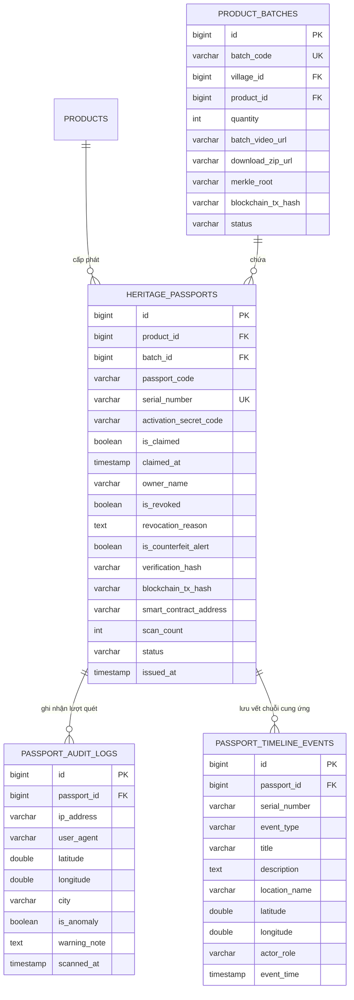

# TỔNG HỢP TOÀN DIỆN PHÂN HỆ: 1. HỘ CHIẾU DI SẢN (HERITAGE PASSPORT)

> **Dự án**: Nền Tảng Số Hóa Di Sản Văn Hóa & E-Commerce Làng Nghề Truyền Thống  
> **Phiên bản tài liệu**: 2.0 (Đã hoàn thiện & Loại bỏ 100% rào cản NFC)  
> **Cập nhật ngày**: 30/09/2026  

---

## 1. GIỚI THIỆU TỔNG QUAN

**Hộ Chiếu Di Sản Số (Digital Heritage Passport)** là hạt nhân công nghệ cốt lõi của nền tảng, đóng vai trò là **Bản sao số vật lý (Physical-to-Digital Twin)** cho từng tác phẩm thủ công mỹ nghệ độc bản xuất xưởng từ các làng nghề truyền thống Việt Nam.

```
       [ TÁC PHẨM VẬT LÝ ]                           [ HỘ CHIẾU DI SẢN SỐ ]
    Gốm Sứ / Sơn Mài / Điêu Khắc                   Sổ cái lưu trữ trên đám mây & Web
               │                                                    │
               ▼                                                    ▼
    ┌─────────────────────────┐                            ┌─────────────────────────┐
    │  Tem QR Decal Vỡ Chống  │ ─────── Quét Mã ─────────► │ • Thông số độc bản & 3D │
    │  Bóc + Mã Serial Độc    │      (Camera/Upload/       │ • Kính lúp soi men gốm  │
    │  Bản + Mã Cào Bảo Mật   │       Nhập mã thủ công)    │ • Video xưởng & Nghệ nhân│
    └─────────────────────────┘                            │ • Giám sát chống giả GPS│
                                                           │ • Sổ cái Merkle on-chain│
                                                           │ • Chứng nhận chính chủ  │
                                                           └─────────────────────────┘
```

### Định Hướng Công Nghệ & Trải Nghiệm Người Dùng:
1. **100% Không phụ thuộc NFC (Zero NFC Overhead)**: Loại bỏ toàn bộ chip NFC, máy đọc thẻ NFC và thao tác chạm thẻ phức tạp. Toàn bộ quy trình chuyển sang sử dụng **Mã Serial độc bản & Tem QR Decal công nghệ cao**, giúp mọi khách hàng sở hữu bất kỳ điện thoại thông minh nào (iOS/Android/Desktop) đều quét và tra cứu được ngay lập tức.
2. **Bảo mật phân tầng**: Kết hợp giữa mã QR công khai (để tra cứu) và mã cào bí mật (`activationSecretCode`) phủ nhũ bạc trên tem vật lý (để kích hoạt quyền sở hữu chính chủ lần đầu).
3. **Bảo chứng sổ cái bất biến**: Áp dụng thuật toán băm SHA-256 kết hợp cây Merkle Root gom theo lô đẩy lên Smart Contract Blockchain (Polygon).

---

## 2. MA TRẬN PHÂN QUYỀN & TÁC NHÂN (ACTORS & PERMISSIONS)

| Tác nhân (Actor) | Quyền hạn trong Phân hệ Hộ Chiếu Di Sản |
| :--- | :--- |
| **Khách vãng lai / Người mua (Public/Collector)** | • Tra cứu công khai Hộ chiếu di sản không cần đăng nhập.<br>• Quét QR bằng Camera, tải ảnh tem hoặc nhập mã Serial.<br>• Sử dụng Kính lúp số học soi chất men, vi mô tác phẩm.<br>• Nhập mã cào bí mật để Kích hoạt quyền sở hữu chính chủ.<br>• Tải Giấy chứng nhận số (Digital Certificate PDF). |
| **Nghệ nhân (Artisan)** | • Tự hoàn thiện tiểu sử, triết lý chế tác và tư liệu phỏng vấn.<br>• Theo dõi thống kê lượt quét tra cứu tác phẩm của mình.<br>• Khai báo thông số tác phẩm và video quy trình chế tác. |
| **Quản lý Làng Nghề (Village Admin)** | • Tạo Hộ chiếu số & sinh mã QR hàng loạt theo Lô sản phẩm.<br>• Xuất file ZIP chứa ảnh vector SVG độ phân giải cao phục vụ in tem.<br>• Phê duyệt lô sản phẩm và kích hoạt quy trình đẩy Merkle Root on-chain.<br>• Cập nhật / xóa video tư liệu quy trình chế tác chung của lô.<br>• Thu hồi / Hủy bỏ Hộ chiếu (Soft-delete) khi phát hiện lỗi hoặc vi phạm. |
| **Hệ thống (System / Background Worker)** | • Ghi nhận Audit Log quét mã bất đồng bộ (`@Async`).<br>• Chạy thuật toán Haversine phát hiện di chuyển bất khả thi để gắn cờ hàng giả.<br>• Gom hash tính toán Merkle Tree và tương tác Smart Contract Polygon. |

---

## 3. CHI TIẾT DANH MỤC 8 CHỨC NĂNG CỐT LÕI

### 3.1. Khởi Tạo Hộ Chiếu & Sinh Mã QR Hàng Loạt Theo Lô (Batch QR Generation)
* **Mục đích**: Hỗ trợ Ban Quản Lý Làng Nghề cấp phát định danh số đồng loạt cho một mẻ nung hoặc một đợt chế tác của xưởng thủ công.
* **Quy tắc nghiệp vụ**:
  * Kiểm tra mẫu sản phẩm (SKU) bắt buộc phải ở trạng thái đã được thẩm định (`APPROVED`).
  * Tự động sinh mã lô (`batch_code`) theo quy chuẩn làng nghề: `{MãLàng}-{MãSKU}-{YYYYMMDD}` (Ví dụ: `BTG-LBC-20261001`).
  * Tự động sinh $N$ bản ghi Hộ chiếu số (`heritage_passports`) với mã Serial duy nhất: `VN-{MãLàng}-{YYYY}-{6 Ký Tự Ngẫu Nhiên}` (Ví dụ: `VN-BTG-2026-X8K9L2`).
  * Sinh mã cào bảo mật ngẫu nhiên (`activation_secret_code`) cấp cho từng tem.
  * Tự động khởi tạo mốc sự kiện chuỗi cung ứng đầu tiên: `CREATED` (Ghi danh tạo lập di sản số).
  * Đóng gói toàn bộ file mã QR vector định dạng SVG vào tệp ZIP (`download_zip_url`) phục vụ xưởng in ấn tem Decal vỡ.
* **API Endpoint**: `POST /api/v1/villages/passports/batch-generate`

---

### 3.2. Tra Cứu Hộ Chiếu Công Khai & Kính Lúp Số Học (Public Verification & Inspection)
* **Mục đích**: Cung cấp giao diện tra cứu minh bạch cho người tiêu dùng và nhà sưu tầm.
* **Đa phương thức tra cứu**:
  1. *Quét mã trực tiếp*: Quét mã QR dán trên sản phẩm bằng Camera điện thoại.
  2. *Tải ảnh QR*: Tải ảnh chụp tem nhãn từ bộ sưu tập ảnh.
  3. *Nhập mã thủ công*: Gõ trực tiếp mã Serial / Passport Code trên thanh tìm kiếm.
* **Thông tin hiển thị toàn diện**:
  * Ảnh hiện vật độ nét cao, quy cách kích thước, vật liệu bản địa, trọng lượng.
  * Video tư liệu bàn xoay / công đoạn chế tác tinh hoa.
  * Hồ sơ nghệ nhân tạo tác: Chân dung, danh hiệu nghệ nhân, thâm niên và triết lý làm nghề.
  * Nhật ký số lượt quét tra cứu (`scan_count`).
* **Tính năng Kính Lúp Số Học (Artwork Magnifier)**:
  * Cho phép người xem rê chuột hoặc chạm màn hình để phóng đại vi mô tác phẩm lên đến **400%**.
  * Soi rõ từng đường nứt của men rạn cổ, vết phóng bút chấm men chàm, từng thớ gỗ mun hay đường thêu chỉ tơ tằm.
* **API Endpoint**: `GET /api/v1/passports/{serialNumber}/verify`

---

### 3.3. Hệ Thống Giám Sát Quét Mã Chống Hàng Giả (Tiered Geo-Velocity Guard)
* **Mục đích**: Phát hiện tức thời hành vi nhân bản, sao chép hoặc giả mạo tem định danh sản phẩm.
* **Cơ chế thu thập dữ liệu bất đồng bộ**:
  * Mỗi lượt quét ghi nhận: Tọa độ GPS, Địa chỉ IP, Thời gian chính xác (Timestamp), User-Agent thiết bị.
  * Xử lý qua `@Async` Service kết hợp Spring Event để không làm chậm thời gian tải trang của người dùng.
* **Thuật toán Vận tốc Di chuyển Bất khả thi (Impossible Travel Velocity)**:
  * Tính khoảng cách trắc địa giữa 2 lượt quét liên tiếp theo công thức Haversine:
    $$d = 2R \cdot \arcsin\left(\sqrt{\sin^2\left(\frac{\Delta\varphi}{2}\right) + \cos(\varphi_1)\cos(\varphi_2)\sin^2\left(\frac{\Delta\lambda}{2}\right)}\right)$$
  * Tính vận tốc dịch chuyển: $V = \frac{d}{\Delta t}$.
  * **Kích hoạt Báo Động Đỏ**: Nếu $V > 900\text{ km/h}$ và $d > 100\text{ km}$ trong thời gian $\Delta t < 5\text{ phút}$:
    * Trạng thái Hộ chiếu tự động chuyển sang `FLAGGED_ANOMALY`.
    * Cờ `is_counterfeit_alert = true`.
    * Khóa tính năng chuyển nhượng và hiển thị cảnh báo đỏ trên màn hình tra cứu của người tiêu dùng.
  * **Phân tầng cảnh báo ISP/4G**: Hệ thống phân biệt sai lệch vị trí do GeoIP của trạm thu phát sóng di động (không khóa nhầm tác phẩm của nghệ nhân, chỉ ghi chú cảnh báo mức độ thấp).

---

### 3.4. Kích Hoạt Quyền Sở Hữu Chính Chủ Lần Đầu (First-Scan Ownership Claim)
* **Mục đích**: Bảo vệ độc quyền của chủ sở hữu đầu tiên mua tác phẩm từ làng nghề.
* **Quy trình kích hoạt**:
  1. Người mua cào lớp tráng bạc trên tem vật lý để lấy `activationSecretCode`.
  2. Truy cập Hộ chiếu di sản số và nhấn nút "Kích Hoạt Sở Hữu".
  3. Nhập mã bí mật, họ tên và ghi chú kỷ niệm (nếu có).
  4. Hệ thống kiểm tra: Nếu mã bí mật khớp và hộ chiếu chưa từng được kích hoạt (`is_claimed = false`), tiến hành xác lập sở hữu.
* **Bảo vệ quyền riêng tư (Privacy Masking)**:
  * Khi tra cứu công khai, tên chủ sở hữu được tự động ẩn danh (Ví dụ: `Ng*** A**`).
  * Chỉ khi đăng nhập bằng tài khoản chủ sở hữu mới xem được toàn bộ thông tin đầy đủ.
* **Cấp Giấy Chứng Nhận Số (Digital Certificate PDF)**:
  * Tự động khởi tạo Giấy chứng nhận quyền sở hữu tác phẩm di sản định dạng A4.
  * Cung cấp nút tải về bản PDF có chữ ký số xác thực của Ban Quản Lý Làng Nghề.
* **API Endpoint**: `POST /api/v1/passports/{serialNumber}/claim`

---

### 3.5. Dòng Thời Gian Chuỗi Cung Ứng & Hành Trình Tác Phẩm (Provenance Timeline)
* **Mục đích**: Minh bạch hóa toàn bộ quá trình từ khi khai thác nguyên liệu, tạo tác tại xưởng đến khi tác phẩm đến tay nhà sưu tầm.
* **Các mốc sự kiện chuẩn hóa (`TimelineEventType`)**:
  * `CREATED`: Khai thác nguyên liệu, tạo phôi dáng tại xưởng.
  * `INSPECTED`: Hội đồng Làng nghề thẩm định chất lượng, âm vang men gốm.
  * `SHIPPED`: Đóng thùng gỗ chèn xốp chuyên dụng, xuất xưởng vận chuyển.
  * `DELIVERED`: Bàn giao nguyên vẹn cho khách hàng / đại lý.
  * `ACTIVATED`: Khách hàng kích hoạt tem bảo chứng chính chủ.
  * `REVOKED`: Thu hồi khi phát hiện sự cố hư hỏng hoặc vi phạm tiêu chuẩn.
* **Dữ liệu mỗi mốc**: Loại sự kiện, tiêu đề, mô tả chi tiết, tọa độ GPS địa điểm thực hiện, người ký nhận và mốc thời gian ISO.
* **API Endpoints**:
  * Ghi mốc mới: `POST /api/v1/passports/{serialNumber}/timeline-events`
  * Lấy lịch sử: `GET /api/v1/passports/{serialNumber}/timeline`

---

### 3.6. Bảo Chứng Merkle Root & Chuỗi Khối (Blockchain Verification)
* **Mục đích**: Đảm bảo dữ liệu nguồn gốc của tác phẩm không thể bị can thiệp, sửa đổi hoặc làm giả trong cơ sở dữ liệu.
* **Thuật toán Băm Bất biến (Leaf Hash)**:
  $$\text{verification\_hash} = \text{SHA-256}(\text{artisan\_id} + \text{product\_id} + \text{serial\_number} + \text{salt})$$
* **Gom Merkle Root Bất đồng bộ**:
  * Khi Ban Quản Lý Làng Nghề duyệt lô (`PUT /api/v1/villages/batches/{batchId}/review`), hệ thống kích hoạt Worker gom mã băm của tất cả $N$ sản phẩm trong lô tạo thành cây Merkle.
  * Gửi giao dịch ghi Merkle Root lên Smart Contract Polygon Amoy Testnet / Mainnet.
* **Cung cấp Bằng chứng Merkle Proof**:
  * Cung cấp danh sách các hash nhánh lân cận (`merkleProof`) và chỉ số vị trí lá (`leafIndex`) để các nhà sưu tầm hoặc đơn vị kiểm định độc lập có thể tự xác minh tính hợp lệ trên Blockchain Explorer.
* **API Endpoint**: `GET /api/v1/passports/{serialNumber}/blockchain-proof`

---

### 3.7. Quản Lý Video Quy Trình Chế Tác Theo Lô (Batch Media Management)
* **Mục đích**: Cho phép Ban Quản Lý Làng Nghề tải lên và gắn video tư liệu chung cho toàn bộ các sản phẩm thuộc cùng một mẻ nung/đợt chế tác.
* **Đặc tính**:
  * Cập nhật URL video (YouTube embed hoặc lưu trữ MinIO S3): `PUT /api/v1/villages/batches/{batchId}/media`.
  * Xóa video khỏi lô khi cần thay thế: `DELETE /api/v1/villages/batches/{batchId}/media`.
  * Thay đổi được tự động đồng bộ tức thì đến tất cả Hộ chiếu di sản thuộc lô đó.

---

### 3.8. Thu Hồi & Hủy Bỏ Hộ Chiếu (Revoke / Soft-Delete)
* **Mục đích**: Vô hiệu hóa Hộ chiếu di sản khi sản phẩm bị vỡ hỏng trong vận chuyển, bị đánh tráo hoặc phát hiện hành vi gian lận thương mại.
* **Quy tắc bảo toàn dữ liệu**:
  * Tuân thủ quy chuẩn **Xóa mềm (Soft-Delete)**: Tuyệt đối không xóa vật lý khỏi Database.
  * Đổi cờ `is_revoked = true`, trạng thái chuyển thành `REVOKED`.
  * Lưu trữ bắt buộc lý do thu hồi (`revocation_reason`).
  * Tự động thêm sự kiện `REVOKED` vào Dòng thời gian tác phẩm.
  * Khi người dùng quét phải mã bị thu hồi, giao diện hiển thị bảng cảnh báo thu hồi màu đỏ, ngăn chặn việc tái sử dụng tem.
* **API Endpoint**: `PUT /api/v1/villages/passports/{serialNumber}/revoke`

---

## 4. BẢNG TỔNG HỢP DANH MỤC API (BACKEND API REFERENCE)

| HTTP Method | Đường Dẫn Endpoint | Actor | Chức Năng Chính |
| :--- | :--- | :--- | :--- |
| `POST` | `/api/v1/villages/passports/batch-generate` | `VILLAGE_ADMIN` | Sinh mã QR và khởi tạo Hộ chiếu hàng loạt theo lô |
| `GET` | `/api/v1/passports/{serialNumber}/verify` | `PUBLIC` | Tra cứu Hộ chiếu di sản & kích hoạt giám sát chống giả |
| `POST` | `/api/v1/passports/{serialNumber}/claim` | `PUBLIC` | Nhập mã cào bí mật kích hoạt sở hữu chính chủ |
| `GET` | `/api/v1/passports/{serialNumber}/timeline` | `PUBLIC` | Lấy dòng thời gian chuỗi cung ứng tác phẩm |
| `POST` | `/api/v1/passports/{serialNumber}/timeline-events` | `VILLAGE_ADMIN` | Bổ sung mốc sự kiện vận chuyển / kiểm định |
| `GET` | `/api/v1/passports/{serialNumber}/blockchain-proof` | `PUBLIC` | Trích xuất nhánh chứng thực Merkle Proof on-chain |
| `PUT` | `/api/v1/villages/batches/{batchId}/review` | `VILLAGE_ADMIN` | Phê duyệt lô & gom Merkle Root đẩy lên Blockchain |
| `PUT` | `/api/v1/villages/batches/{batchId}/media` | `VILLAGE_ADMIN` | Cập nhật video tư liệu quy trình chế tác theo lô |
| `DELETE` | `/api/v1/villages/batches/{batchId}/media` | `VILLAGE_ADMIN` | Xóa video tư liệu của lô sản phẩm |
| `PUT` | `/api/v1/villages/passports/{serialNumber}/revoke` | `VILLAGE_ADMIN` | Thu hồi / hủy bỏ hộ chiếu di sản (xóa mềm) |

---

## 5. THIẾT KẾ CƠ SỞ DỮ LIỆU (DATABASE SCHEMA)



---

## 6. DANH MỤC THÀNH PHẦN GIAO DIỆN (FRONTEND COMPONENTS)

| Tên Tệp Component / Page | Đường Dẫn Tệp Mã Nguồn | Chức Năng Trong Giao Diện |
| :--- | :--- | :--- |
| `PassportDetailPage.tsx` | [`fe/src/modules/passport/pages/PassportDetailPage.tsx`](file:///d:/RND/fe/src/modules/passport/pages/PassportDetailPage.tsx) | Trang tra cứu Hộ chiếu di sản công khai, hiển thị thông số hiện vật, video chế tác và câu chuyện nghệ nhân. |
| `ArtworkMagnifier.tsx` | [`fe/src/components/passport/ArtworkMagnifier.tsx`](file:///d:/RND/fe/src/components/passport/ArtworkMagnifier.tsx) | Kính lúp số học soi cận cảnh chất men, vân thớ tác phẩm với độ phóng đại lên tới 400%. |
| `AntiCounterfeitTester.tsx` | [`fe/src/components/passport/AntiCounterfeitTester.tsx`](file:///d:/RND/fe/src/components/passport/AntiCounterfeitTester.tsx) | Bảng điều khiển mô phỏng quét GPS thực địa và kiểm định an ninh chống sao chép tem QR. |
| `CertificateModal.tsx` | [`fe/src/components/passport/CertificateModal.tsx`](file:///d:/RND/fe/src/components/passport/CertificateModal.tsx) | Cửa sổ Giấy Chứng Nhận Kỹ Thuật Số khổ A4 có chữ ký số và tùy chọn in ấn / xuất file. |
| `BatchManagementModal.tsx` | [`fe/src/modules/passport/components/BatchManagementModal.tsx`](file:///d:/RND/fe/src/modules/passport/components/BatchManagementModal.tsx) | Modal Quản lý Lô & Phê duyệt cấp phát Merkle Root dành cho Ban Quản Lý Làng Nghề. |
| `QrExportModal.tsx` | [`fe/src/modules/passport/components/QrExportModal.tsx`](file:///d:/RND/fe/src/modules/passport/components/QrExportModal.tsx) | Modal xem trước và tải gói ZIP tem QR vector độ nét cao phục vụ in ấn tem Decal. |
| `QrScannerModal.tsx` | [`fe/src/modules/passport/components/QrScannerModal.tsx`](file:///d:/RND/fe/src/modules/passport/components/QrScannerModal.tsx) | Modal quét mã QR tích hợp trực tiếp Camera thiết bị hoặc tải tệp ảnh từ máy. |
| `heritageApi.ts` | [`fe/src/services/heritageApi.ts`](file:///d:/RND/fe/src/services/heritageApi.ts) | Tầng kết nối API client tra cứu hộ chiếu, chuẩn hóa dữ liệu và fallback ngoại tuyến. |

---

## 7. KẾT LUẬN & ĐIỂM NỔI BẬT

1. **Chuẩn hóa quy trình nghiệp vụ**: Khép kín trọn vẹn từ lúc nghệ nhân tạo tác phôi gốm, Ban Quản Lý cấp phát lô mã QR, vận chuyển qua các trạm chuỗi cung ứng, cho đến khi khách hàng cào mã kích hoạt sở hữu chính chủ.
2. **Loại bỏ 100% rào cản NFC**: Giúp giảm thiểu chi phí phần cứng thẻ chip đắt đỏ, loại bỏ lỗi tương thích đầu đọc, đưa nền tảng tiếp cận dễ dàng tới hàng triệu khách hàng chỉ qua Camera điện thoại.
3. **Tính toàn vẹn cao**: Sự kết hợp giữa thuật toán phát hiện gian lận vận tốc di chuyển (Haversine) và cây băm Merkle Root trên Blockchain đem lại sự tin cậy tuyệt đối cho các tác phẩm di sản làng nghề Việt Nam.
