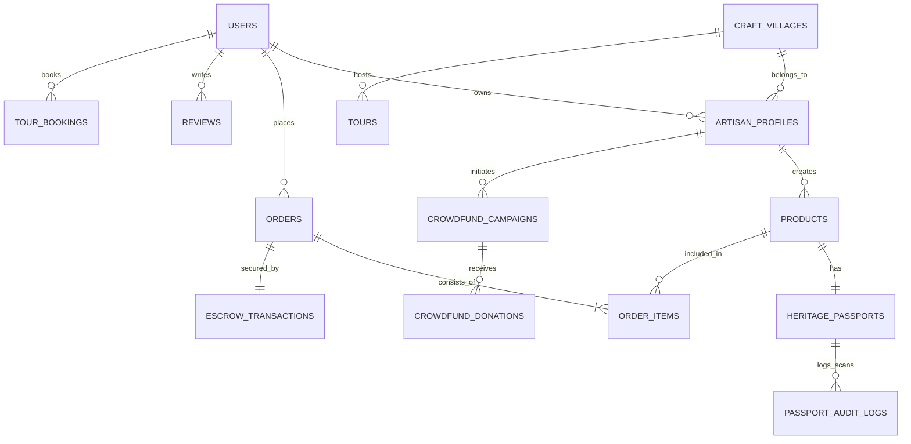

# BỘ TÀI LIỆU ĐẶC TẢ YÊU CẦU, THIẾT KẾ HỆ THỐNG VÀ KIẾN TRÚC KỸ THUẬT
## DỰ ÁN: NỀN TẢNG SỐ HÓA DI SẢN VĂN HÓA VÀ THƯƠNG MẠI ĐIỆN TỬ LÀNG NGHỀ TRUYỀN THỐNG
* **Frontend:** React, TypeScript, Zustand, TanStack Query, Neo-Heritage Modern UI Design System
* **Backend:** Spring Boot 3.x, Spring Security, JPA/Hibernate, PostgreSQL, Web3j (Blockchain)

---

## MỤC LỤC
1. [BỘ QUY TẮC PHÁT TRIỂN HỆ THỐNG (SYSTEM & CODING RULES)](#1-bộ-quy-tắc-phát-triển-hệ-thống-system--coding-rules)
2. [ĐẶC TẢ YÊU CẦU CHI TIẾT CÁC TÍNH NĂNG (FUNCTIONAL REQUIREMENTS)](#2-đặc-tả-yêu-cầu-chi-tiết-các-tính-năng-functional-requirements)
3. [THIẾT KẾ CƠ SỞ DỮ LIỆU TOÀN DIỆN (DATABASE SCHEMA & ERD)](#3-thiết-kế-cơ-sở-dữ-liệu-toàn-diện-database-schema--erd)
4. [THIẾT KẾ GIAO DIỆN (UI/UX) THEO PHONG CÁCH "NEO-HERITAGE" HIỆN ĐẠI](#4-thiết-kế-giao-diện-uiux-theo-phong-cách-neo-heritage-hiện-đại)
5. [CẤU TRÚC TỔ CHỨC SOURCE CODE DỰ ÁN (PROJECT STRUCTURE)](#5-cấu-trúc-tổ-chức-source-code-dự-án-project-structure)

---

# 1. BỘ QUY TẮC PHÁT TRIỂN HỆ THỐNG (SYSTEM & CODING RULES)

### 1.1. Quy tắc Nghiệp vụ cốt lõi (Business Rules)
1. **Tính bất biến của Hộ chiếu Di sản (Heritage Immutability):**
   * Mỗi sản phẩm xuất xưởng hoặc mẻ sản phẩm thủ công chỉ được cấp một Hộ chiếu Di sản duy nhất với mã `passport_code` (UUID v4 hoặc Hash).
   * Dữ liệu chứng thực sau khi ký số và đẩy lên Blockchain Ledger (Polygon/BNB Chain hoặc Permissioned EVM) là bất biến. Mọi sự thay đổi trạng thái (chuyển giao sở hữu, bảo hành, phục chế) chỉ được ghi nối tiếp dạng nhật ký sự kiện (Append-Only Event Sourcing).
2. **Cơ chế Chống hàng giả & Phát hiện bất thường (Anti-Counterfeiting Engine):**
   * Mỗi lượt quét mã QR/NFC vật lý đều được ghi nhận tọa độ GPS, địa chỉ IP, Timestamp và User-Agent.
   * Kích hoạt cờ cảnh báo bất thường (`FLAGGED_ANOMALY`) nếu:
     * Cùng một mã được quét tại 2 vị trí địa lý cách xa nhau bất thường trong khoảng thời gian không thể di chuyển (Impossible Travel Velocity).
     * Số lần quét vượt ngưỡng an toàn ($> 50$ lần quét từ các IP lạ không gắn với phiên người mua chính chủ).
3. **Đánh giá có xác thực (Verified Heritage Reviews):**
   * Khách hàng chỉ được để lại nhận xét, hình ảnh, chấm sao sau khi đơn hàng chuyển sang trạng thái `DELIVERED` và đã ký nhận thành công.
4. **Cơ chế Ký quỹ & Rút tiền Nghệ nhân (Escrow & Settlement):**
   * Tiền thanh toán của khách hàng được giữ tại ví trung gian ký quỹ (`Escrow Account`).
   * Doanh thu chỉ được giải ngân vào ví khả dụng (`Available Balance`) của nghệ nhân sau thời hạn đổi trả/khiếu nại (mặc định 7 ngày kể từ khi khách nhận hàng).
5. **Quy tắc Xóa mềm (Soft Delete):**
   * Tuyệt đối không xóa cứng (Hard Delete) hồ sơ nghệ nhân, tác phẩm di sản, giao dịch đơn hàng hay thông tin làng nghề. Sử dụng cờ `is_deleted = true` hoặc cập nhật trạng thái `status = 'ARCHIVED'/'DELETED'`.

### 1.2. Quy tắc Kỹ thuật Backend (Spring Boot 3.x)
* **Kiến trúc phân tầng rạch ròi:**
  * `Controller`: Tiếp nhận HTTP Request, validate DTO đầu vào, điều phối luồng phản hồi chuẩn `ApiResponse<T>`.
  * `Service`: Xử lý nghiệp vụ chính, bảo đảm tính toàn vẹn Transaction (`@Transactional`).
  * `Repository`: Kế thừa Spring Data JPA / QueryDSL, tối ưu query tránh lỗi $N+1$ bằng `JOIN FETCH` hoặc `@EntityGraph`.
  * `Infrastructure / Integration`: Tích hợp dịch vụ bên thứ ba (Web3j, Cloudflare R2 / AWS S3, Cổng thanh toán VNPay/MoMo/VietQR).
* **Xử lý bất đồng bộ & Hàng đợi:**
  * Tác vụ ghi nhận nhật ký quét mã QR, gửi email thông báo, nén ảnh/video, mint NFT trên Blockchain được xử lý ngầm (Async) qua Spring `@Async` hoặc Message Queue (RabbitMQ / Kafka).
* **Bảo mật & Phân quyền:**
  * Sử dụng Spring Security 6 với JWT Stateless Token, RBAC hỗ trợ các vai trò: `ROLE_CUSTOMER`, `ROLE_ARTISAN`, `ROLE_MODERATOR`, `ROLE_ADMIN`.

### 1.3. Quy tắc Kỹ thuật Frontend (React + TypeScript)
* **Quản lý Trạng thái:**
  * Client UI State: Sử dụng **Zustand** kết hợp **Immer** middleware để cập nhật state an toàn.
  * Server Remote State: Sử dụng **TanStack Query (React Query)** để quản lý cache, invalidate, loading và background refetching.
* **Component-Based Architecture:**
  * Đặt tên thư mục theo `kebab-case`, component và kiểu dữ liệu theo `PascalCase`, hook và hàm phụ trợ theo `camelCase`.
  * Tuyệt đối không hard-code ngôn ngữ hiển thị; cấu hình i18n (`react-i18next`) phục vụ cả tiếng Việt và tiếng Anh cho du khách quốc tế.
* **Tương thích & Đồ họa:**
  * Hỗ trợ hiển thị 3D tương tác xoay 360° với `@react-three/fiber` hoặc Web Component `@google/model-viewer`.
  * Tích hợp WebXR cho phép xem trước mô hình 3D thực tế ảo (AR) trên điện thoại thông minh mà không cần cài đặt ứng dụng native.

---

# 2. ĐẶC TẢ YÊU CẦU CHI TIẾT CÁC TÍNH NĂNG (FUNCTIONAL REQUIREMENTS)

```
+-----------------------------------------------------------------------------------+
|                  HỆ THỐNG DI SẢN VĂN HÓA & E-COMMERCE LÀNG NGHỀ                  |
+-------------------+--------------------+--------------------+---------------------+
| 1. HỘ CHIẾU DI SẢN| 2. THƯƠNG MẠI ĐT   | 3. STUDIO NGHỆ NHÂN| 4. BẢO TỒN & DU LỊCH|
| • QR/NFC độc bản  | • Gian hàng số     | • Giao diện tối giản| • Bản đồ làng nghề  |
| • Video chế tác   | • Bộ lọc vùng miền | • Sinh mã 1-click  | • Đặt Tour trải nghiệm|
| • Nguồn gốc Blockchain| • Đặt tác phẩm riêng| • Quản lý kho, ví | • Quyên góp truyền nghề|
| • Cảnh báo hàng giả| • Thanh toán Escrow| • Báo cáo quét mã  | • Tạp chí văn hóa   |
+-------------------+--------------------+--------------------+---------------------+
```

### Module 1: Hộ chiếu Di sản Số (Digital Heritage Passport)
1. **Định danh độc bản (Unique Physical-to-Digital Twin):**
   * Mỗi tác phẩm được gán 1 mã QR bảo mật hoặc nhúng chip NFC NTAG213/215 chống ghi đè.
   * Quét mã dẫn trực tiếp đến trang tra cứu Hộ chiếu Di sản độc bản không cần đăng nhập.
2. **Trang Tra cứu Hành trình Tác phẩm (Heritage Storyline):**
   * Hiển thị thông tin nghệ nhân chế tác (ảnh chân dung, danh hiệu, câu nói tâm huyết).
   * Video tư liệu ngắn (30s - 2 phút) ghi lại công đoạn khó nhất khi tạo tác.
   * Dữ liệu nguyên vật liệu tự nhiên (đất sét Cao Lanh, men tro, đồng đỏ nguyên chất...).
   * Thông tin khối và mã Hash xác thực trên Blockchain Explorer.
3. **Cảnh báo chống hàng giả tự động:**
   * Hệ thống hiển thị số lần mã này đã được quét (`Số lượt quét: 1/1` đối với sản phẩm mới mua).
   * Nếu phát hiện bất thường, màn hình hiển thị banner cảnh báo màu đỏ kèm số hotline hỗ trợ của Hội đồng Nghệ nhân Làng nghề.

### Module 2: Thương mại Điện tử Di sản & Đặt hàng Tác phẩm
1. **Gian hàng số Nghệ nhân & Làng nghề (Heritage Storefront):**
   * Trang định danh riêng biệt mang đậm dấu ấn làng nghề (ví dụ: Không gian Gốm Bát Tràng, Không gian Dệt Lụa Vạn Phúc).
2. **Bộ lọc văn hóa chuyên sâu:**
   * Tìm kiếm theo dòng chất liệu (Men rạn, Men ngọc, Gỗ trắc, Lụa tơ sen...).
   * Tìm kiếm theo vùng văn hóa địa lý (Bắc Bộ, Trung Bộ, Tây Nguyên, Nam Bộ).
   * Phân loại: Tác phẩm sưu tầm độc bản (1 of 1) hoặc Sản phẩm ứng dụng đời sống.
3. **Đặt tác phẩm theo yêu cầu (Custom Commission / Đấu giá):**
   * Người mua gửi bản vẽ/mô tả ý tưởng $\to$ Nghệ nhân báo giá và thời gian hoàn thành $\to$ Người mua đặt cọc 30-50% qua sàn.
   * Nghệ nhân cập nhật tiến độ theo từng mốc (tạo phôi, nung, phủ men, hoàn thiện) bằng hình ảnh/video.
4. **Thanh toán & Ký quỹ an toàn (Escrow):**
   * Hỗ trợ VietQR, Thẻ quốc tế, Ví điện tử và COD có cọc.
   * Cơ chế ký quỹ đảm bảo quyền lợi đôi bên trước khi giải ngân.

### Module 3: Kênh Nghệ nhân (Artisan Studio)
1. **Giao diện Tối giản Hóa (Elderly-Friendly & Accessible):**
   * Thiết kế giao diện riêng biệt cho nghệ nhân cao tuổi: Cỡ chữ lớn ($16-20\text{px}$), nút bấm to bản, màu sắc độ tương phản cao, thao tác dưới 3 bước.
   * Hỗ trợ trợ lý nhập liệu bằng giọng nói (Voice-to-Text).
2. **Khởi tạo Hộ chiếu 1 chạm:**
   * Nghệ nhân chụp ảnh tác phẩm $\to$ Nhập tên tác phẩm $\to$ Chọn mẻ lò $\to$ Hệ thống tự động sinh file PDF tem nhãn chứa QR Code chuẩn kích thước máy in nhiệt.
3. **Quản trị Bán hàng & Doanh thu:**
   * Quản lý đơn đặt hàng, in phiếu vận chuyển, xác nhận đóng gói.
   * Theo dõi số dư khả dụng, rút tiền về tài khoản ngân hàng liên kết trong 24 giờ.

### Module 4: Bảo tồn, Bản đồ số & Tour Trải nghiệm
1. **Bản đồ Di sản Làng nghề tương tác (Interactive Heritage Map):**
   * Bản đồ tương tác trực quan hiển thị các điểm sáng di sản văn hóa Việt Nam.
   * Cho phép lọc các làng nghề đang có nguy cơ mai một hoặc các làng nghề du lịch phát triển.
   * Xem hồ sơ chi tiết, lịch sử hình thành, nghệ nhân đại diện và tuyến đường tham quan.
2. **Đặt lịch Tour Trải nghiệm (Craft Experience Booking):**
   * Cung cấp các gói tour trải nghiệm thực tế (học vuốt gốm, trải nghiệm nhuộm chàm, thêu tranh dân gian).
   * Đặt chỗ trực tuyến theo khung giờ, xuất vé điện tử QR Code cho du khách.
3. **Gây quỹ Cộng đồng (Heritage Crowdfunding):**
   * Khởi động các dự án phục dựng kỹ nghệ cổ truyền, hỗ trợ nghệ nhân trẻ lập nghiệp.
   * Nhà tài trợ nhận quà tri ân đặc quyền theo từng mốc quyên góp.

### Module 5: Quản trị Hệ thống & Quản lý Minh bạch (Admin & Ledger)
1. **Kiểm duyệt 2 lớp:**
   * Thẩm định hồ sơ công nhận nghệ nhân trước khi cấp quyền bán hàng.
   * Kiểm duyệt chất lượng và tính nguyên bản của tác phẩm trước khi niêm yết.
2. **Giám sát Blockchain & Quản lý Tài chính:**
   * Theo dõi tiến trình ghi sổ cái phân tán, quản lý pool phí gas.
   * Cấu hình biểu phí sàn, tỷ lệ hoa hồng chiết khấu, giải quyết khiếu nại tranh chấp.

---

# 3. THIẾT KẾ CƠ SỞ DỮ LIỆU TOÀN DIỆN (DATABASE SCHEMA & ERD)



### 3.1. Kịch bản DDL SQL Chi tiết (PostgreSQL 15+)

```sql
-- ========================================================
-- 1. BẢNG NGƯỜI DÙNG & PHÂN QUYỀN
-- ========================================================
CREATE TABLE users (
    id BIGSERIAL PRIMARY KEY,
    email VARCHAR(150) UNIQUE NOT NULL,
    phone VARCHAR(20) UNIQUE,
    password_hash VARCHAR(255) NOT NULL,
    full_name VARCHAR(100) NOT NULL,
    avatar_url TEXT,
    role VARCHAR(30) NOT NULL DEFAULT 'ROLE_CUSTOMER', -- ROLE_CUSTOMER, ROLE_ARTISAN, ROLE_ADMIN
    status VARCHAR(30) NOT NULL DEFAULT 'ACTIVE',       -- ACTIVE, SUSPENDED, DELETED
    is_deleted BOOLEAN DEFAULT FALSE,
    created_at TIMESTAMP WITH TIME ZONE DEFAULT CURRENT_TIMESTAMP,
    updated_at TIMESTAMP WITH TIME ZONE DEFAULT CURRENT_TIMESTAMP
);

-- ========================================================
-- 2. BẢNG LÀNG NGHỀ TRUYỀN THỐNG
-- ========================================================
CREATE TABLE craft_villages (
    id BIGSERIAL PRIMARY KEY,
    name VARCHAR(200) NOT NULL,
    slug VARCHAR(220) UNIQUE NOT NULL,
    region VARCHAR(50) NOT NULL,                       -- Bac_Bo, Trung_Bo, Tay_Nguyen, Nam_Bo
    province VARCHAR(100) NOT NULL,
    historical_summary TEXT NOT NULL,
    founding_year_estimate INT,
    ancestor_worship_info TEXT,                        -- Thờ cúng Thành Hoàng / Tổ nghề
    latitude DOUBLE PRECISION NOT NULL,
    longitude DOUBLE PRECISION NOT NULL,
    cover_image_url TEXT,
    is_active BOOLEAN DEFAULT TRUE,
    created_at TIMESTAMP WITH TIME ZONE DEFAULT CURRENT_TIMESTAMP
);

-- ========================================================
-- 3. BẢNG HỒ SƠ NGHỆ NHÂN
-- ========================================================
CREATE TABLE artisan_profiles (
    id BIGSERIAL PRIMARY KEY,
    user_id BIGINT UNIQUE NOT NULL REFERENCES users(id) ON DELETE CASCADE,
    craft_village_id BIGINT REFERENCES craft_villages(id),
    title VARCHAR(100) NOT NULL,                       -- Nghệ nhân Ưu tú, Nghệ nhân Dân gian...
    bio TEXT NOT NULL,
    experience_years INT NOT NULL,
    workshop_address TEXT NOT NULL,
    kyc_document_url TEXT,                             -- Chứng nhận danh hiệu / giấy phép
    verification_status VARCHAR(30) DEFAULT 'PENDING',  -- PENDING, VERIFIED, REJECTED
    available_balance NUMERIC(15,2) DEFAULT 0.00,
    escrow_balance NUMERIC(15,2) DEFAULT 0.00,
    bank_account_info JSONB,                           -- { "bank_code": "VCB", "account_no": "...", "account_name": "..." }
    created_at TIMESTAMP WITH TIME ZONE DEFAULT CURRENT_TIMESTAMP
);

-- ========================================================
-- 4. BẢNG SẢN PHẨM / TÁC PHẨM THỦ CÔNG
-- ========================================================
CREATE TABLE products (
    id BIGSERIAL PRIMARY KEY,
    artisan_id BIGINT NOT NULL REFERENCES artisan_profiles(id),
    name VARCHAR(255) NOT NULL,
    slug VARCHAR(280) UNIQUE NOT NULL,
    category_id INT NOT NULL,                          -- 1: Gốm sứ, 2: Lụa, 3: Gỗ, 4: Kim hoàn...
    description TEXT NOT NULL,
    material_info TEXT NOT NULL,                       -- Nguyên liệu tự nhiên chế tác
    dimensions VARCHAR(100),                           -- Dài x Rộng x Cao
    weight_gram INT,
    price NUMERIC(15,2) NOT NULL,
    stock_quantity INT DEFAULT 1,
    is_unique_artwork BOOLEAN DEFAULT FALSE,           -- Độc bản hay sản phẩm thông thường
    model_3d_url TEXT,                                 -- Đường dẫn file .glb/.gltf
    status VARCHAR(30) DEFAULT 'DRAFT',                -- DRAFT, PENDING_APPROVAL, PUBLISHED, ARCHIVED
    is_deleted BOOLEAN DEFAULT FALSE,
    created_at TIMESTAMP WITH TIME ZONE DEFAULT CURRENT_TIMESTAMP,
    updated_at TIMESTAMP WITH TIME ZONE DEFAULT CURRENT_TIMESTAMP
);

-- ========================================================
-- 5. BẢNG HỘ CHIẾU DI SẢN SỐ (HERITAGE PASSPORT)
-- ========================================================
CREATE TABLE heritage_passports (
    id BIGSERIAL PRIMARY KEY,
    product_id BIGINT UNIQUE NOT NULL REFERENCES products(id),
    passport_code VARCHAR(64) UNIQUE NOT NULL,         -- Mã định danh công khai tra cứu QR
    nfc_tag_uid VARCHAR(128) UNIQUE,                   -- UID vật lý của chip NFC
    crafting_video_url TEXT,                           -- Video ký sự chế tác
    artisan_story_quote TEXT,                          -- Lời tự sự của nghệ nhân
    blockchain_tx_hash VARCHAR(128),                   -- Transaction Hash trên Blockchain
    blockchain_token_id VARCHAR(64),                   -- NFT / Token ID
    smart_contract_address VARCHAR(64),
    verification_hash VARCHAR(256) NOT NULL,           -- SHA-256 đối chiếu tính toàn vẹn
    scan_count INT DEFAULT 0,
    status VARCHAR(30) DEFAULT 'ACTIVE',               -- ACTIVE, FLAGGED_ANOMALY, REVOKED
    issued_at TIMESTAMP WITH TIME ZONE DEFAULT CURRENT_TIMESTAMP
);

-- ========================================================
-- 6. NHẬT KÝ QUÉT TRA CỨU QR/NFC (AUDIT TRAIL & CHỐNG GIẢ)
-- ========================================================
CREATE TABLE passport_audit_logs (
    id BIGSERIAL PRIMARY KEY,
    passport_id BIGINT NOT NULL REFERENCES heritage_passports(id),
    scanned_at TIMESTAMP WITH TIME ZONE DEFAULT CURRENT_TIMESTAMP,
    ip_address VARCHAR(45) NOT NULL,
    user_agent TEXT,
    latitude DOUBLE PRECISION,
    longitude DOUBLE PRECISION,
    city VARCHAR(100),
    country VARCHAR(100),
    is_anomaly BOOLEAN DEFAULT FALSE                   -- Đánh dấu lượt quét đáng ngờ
);
CREATE INDEX idx_passport_audit_lookup ON passport_audit_logs(passport_id, scanned_at DESC);

-- ========================================================
-- 7. BẢNG ĐƠN HÀNG VÀ CHI TIẾT ĐƠN HÀNG
-- ========================================================
CREATE TABLE orders (
    id BIGSERIAL PRIMARY KEY,
    order_code VARCHAR(50) UNIQUE NOT NULL,            -- Mã đơn hiển thị (VD: VN-2026-0001)
    customer_id BIGINT NOT NULL REFERENCES users(id),
    total_amount NUMERIC(15,2) NOT NULL,
    discount_amount NUMERIC(15,2) DEFAULT 0.00,
    shipping_fee NUMERIC(15,2) DEFAULT 0.00,
    final_amount NUMERIC(15,2) NOT NULL,
    payment_method VARCHAR(30) NOT NULL,               -- VIETQR, MOMO, CREDIT_CARD, COD
    payment_status VARCHAR(30) DEFAULT 'PENDING',       -- PENDING, PAID, FAILED, REFUNDED
    shipping_status VARCHAR(30) DEFAULT 'PREPARING',   -- PREPARING, SHIPPED, DELIVERED, RETURNED
    shipping_address JSONB NOT NULL,                   -- { "recipient": "...", "phone": "...", "address": "..." }
    order_type VARCHAR(20) DEFAULT 'STANDARD',         -- STANDARD, CUSTOM_COMMISSION
    created_at TIMESTAMP WITH TIME ZONE DEFAULT CURRENT_TIMESTAMP
);

CREATE TABLE order_items (
    id BIGSERIAL PRIMARY KEY,
    order_id BIGINT NOT NULL REFERENCES orders(id) ON DELETE CASCADE,
    product_id BIGINT NOT NULL REFERENCES products(id),
    unit_price NUMERIC(15,2) NOT NULL,
    quantity INT NOT NULL,
    subtotal NUMERIC(15,2) NOT NULL
);

-- ========================================================
-- 8. BẢNG GIAO DỊCH KÝ QUỸ (ESCROW ENGINE)
-- ========================================================
CREATE TABLE escrow_transactions (
    id BIGSERIAL PRIMARY KEY,
    order_id BIGINT UNIQUE NOT NULL REFERENCES orders(id),
    artisan_id BIGINT NOT NULL REFERENCES artisan_profiles(id),
    hold_amount NUMERIC(15,2) NOT NULL,
    platform_fee NUMERIC(15,2) NOT NULL,
    net_payout NUMERIC(15,2) NOT NULL,
    status VARCHAR(30) DEFAULT 'HOLDING',              -- HOLDING, RELEASED, REFUNDED
    auto_release_date TIMESTAMP WITH TIME ZONE NOT NULL,
    released_at TIMESTAMP WITH TIME ZONE
);

-- ========================================================
-- 9. BẢNG TOUR DU LỊCH TRẢI NGHIỆM LÀNG NGHỀ
-- ========================================================
CREATE TABLE tours (
    id BIGSERIAL PRIMARY KEY,
    craft_village_id BIGINT NOT NULL REFERENCES craft_villages(id),
    artisan_id BIGINT REFERENCES artisan_profiles(id),
    title VARCHAR(255) NOT NULL,
    description TEXT NOT NULL,
    duration_hours INT NOT NULL,
    price_per_person NUMERIC(12,2) NOT NULL,
    max_participants INT NOT NULL,
    meeting_point TEXT NOT NULL,
    included_materials TEXT,                           -- Đồ bảo hộ, đất thực hành, màu vẽ...
    is_active BOOLEAN DEFAULT TRUE,
    created_at TIMESTAMP WITH TIME ZONE DEFAULT CURRENT_TIMESTAMP
);

CREATE TABLE tour_bookings (
    id BIGSERIAL PRIMARY KEY,
    tour_id BIGINT NOT NULL REFERENCES tours(id),
    customer_id BIGINT NOT NULL REFERENCES users(id),
    booking_date DATE NOT NULL,
    time_slot VARCHAR(50) NOT NULL,                    -- "08:30 - 11:30"
    number_of_people INT NOT NULL,
    total_price NUMERIC(12,2) NOT NULL,
    booking_status VARCHAR(30) DEFAULT 'CONFIRMED',     -- CONFIRMED, COMPLETED, CANCELLED
    ticket_qr_code VARCHAR(128) UNIQUE NOT NULL,
    created_at TIMESTAMP WITH TIME ZONE DEFAULT CURRENT_TIMESTAMP
);

-- ========================================================
-- 10. BẢNG GÂY QUỸ CỘNG ĐỒNG BẢO TỒN (CROWDFUNDING)
-- ========================================================
CREATE TABLE crowdfund_campaigns (
    id BIGSERIAL PRIMARY KEY,
    artisan_id BIGINT NOT NULL REFERENCES artisan_profiles(id),
    craft_village_id BIGINT REFERENCES craft_villages(id),
    title VARCHAR(255) NOT NULL,
    story_content TEXT NOT NULL,
    target_amount NUMERIC(15,2) NOT NULL,
    current_amount NUMERIC(15,2) DEFAULT 0.00,
    start_date DATE NOT NULL,
    end_date DATE NOT NULL,
    status VARCHAR(30) DEFAULT 'ACTIVE',               -- ACTIVE, GOAL_REACHED, EXPIRED, CANCELLED
    reward_tiers JSONB,                                -- Mức quyên góp & quà tri ân
    created_at TIMESTAMP WITH TIME ZONE DEFAULT CURRENT_TIMESTAMP
);
```

---

# 4. THIẾT KẾ GIAO DIỆN (UI/UX) THEO PHONG CÁCH "NEO-HERITAGE" HIỆN ĐẠI

### 4.1. Triết lý Thiết kế (Design Philosophy)
Thiết kế hướng tới phong cách **Neo-Heritage** (Tân Di Sản): Giữ trọn vẻ trầm mặc, mộc mạc và tinh tế của văn hóa cổ truyền Việt Nam nhưng trình bày bằng hình khối phẳng tối giản, khoảng trắng rộng rãi (generous whitespace), hiệu ứng kính mờ (glassmorphism) và công nghệ 3D/AR tiên tiến.

* **Bảng màu nhận diện (Color Palette):**
  * `Men Lam Sâu (Deep Indigo Navy)`: `#1A365D` - Màu sắc chính cho tiêu đề, thanh điều hướng, đại diện cho men gốm hoa lam cổ.
  * `Men Ngọc Celadon`: `#2C7A7B` - Màu phụ cho nhãn xác thực, chứng nhận chất lượng, mang nét thanh lịch di sản.
  * `Đất Nung Terracotta / Đỏ Gạch Son`: `#C53030` - Màu điểm nhấn cho nút kêu gọi hành động (CTA), cảnh báo, triện dấu nghệ nhân.
  * `Giấy Dó Trắng Ấm (Dó Paper Ivory)`: `#FBF9F5` - Màu nền chủ đạo, dịu mắt, gợi liên tưởng đến xơ sợi giấy Dó cổ truyền.
  * `Vàng Đồng Cổ (Antique Brass)`: `#D69E2E` - Dành cho huy hiệu Nghệ nhân Nhân dân / Nghệ nhân Ưu tú.

* **Hệ thống Font chữ (Typography):**
  * **Tiêu đề & Thương hiệu:** Kiểu chữ có chân thanh nhã (*Playfair Display* hoặc *Cormorant Garamond*).
  * **Nội dung & Nhập liệu:** Kiểu chữ không chân hiện đại, độ rõ nét cao trên màn hình (*Inter* hoặc *Plus Jakarta Sans*).

---

### 4.2. Chi tiết Thiết kế Bố cục Màn hình Cốt lõi

#### Màn hình 1: Trang Chủ & Bản Đồ Số Di Sản (Interactive Heritage Map)

```
+---------------------------------------------------------------------------------------------------------+
|  [Logo Di Sản]    Bản Đồ Số  |  Hộ Chiếu  |  Gian Hàng Làng Nghề  |  Tour Trải Nghiệm   [🔍] [🛒] [User] |
+---------------------------------------------------------------------------------------------------------+
| HERO SECTION: Video nền 4K thước phim ngắn nghệ nhân đang chuốt gốm trên bàn xoay                    |
|                                                                                                         |
|       "LƯU GIỮ HỒN DÂN TỘC TRONG TỪNG NÉT CHẾ TÁC THỦ CÔNG"                                             |
|       Số hóa và bảo chứng nguồn gốc độc bản cho hàng nghìn tác phẩm làng nghề Việt Nam.                 |
|                                                                                                         |
|       [ 🗺️ Khám Phá Bản Đồ Làng Nghề ]          [ 📱 Tra Cứu Hộ Chiếu Bằng Mã ]                        |
+---------------------------------------------------------------------------------------------------------+
| BẢN ĐỒ TƯƠNG TÁC LÀNG NGHỀ VIỆT NAM (Tích hợp WebGL / Mapbox):                                         |
|                                                                                                         |
|  +----------------------------------------------+  +-------------------------------------------------+  |
|  |             BẢN ĐỒ VIỆT NAM TRỰC QUAN         |  | THÔNG TIN LÀNG NGHỀ ĐANG CHỌN                   |  |
|  |                                              |  |                                                 |  |
|  |    📍 Làng Gốm Bát Tràng (Hà Nội)             |  | 🏺 Làng Gốm Bát Tràng                           |  |
|  |    📍 Làng Lụa Vạn Phúc (Hà Đông)            |  | Tuổi nghề: Hơn 700 năm                          |  |
|  |    📍 Làng Đúc Đồng Ngũ Xã                   |  | Vùng văn hóa: Đồng bằng Bắc Bộ                  |  |
|  |    📍 Làng Đá Non Nước (Đà Nẵng)             |  | Số nghệ nhân đang hoạt động: 42 nghệ nhân       |  |
|  |    📍 Làng Gốm Bàu Trúc (Ninh Thuận)         |  | Số tác phẩm có Hộ chiếu số: 380 tác phẩm        |  |
|  |                                              |  |                                                 |  |
|  |  (Bộ lọc: [Tất cả] [Gốm sứ] [Dệt vải] [Đúc]) |  | [ Ghé Thăm Gian Hàng ]  [ Đặt Tour Trải Nghiệm ]|  |
|  +----------------------------------------------+  +-------------------------------------------------+  |
+---------------------------------------------------------------------------------------------------------+
| TÁC PHẨM ĐỘC BẢN TIÊU BIỂU (CAROUSEL HIỆU ỨNG THẺ NỔI):                                                 |
| +-------------------------+ +-------------------------+ +-------------------------+                      |
| | [Ảnh tác phẩm]          | | [Ảnh tác phẩm]          | | [Ảnh tác phẩm]          |                      |
| | Bình Men Lam Cổ Cá Chép | | Khăn Lụa Tơ Tằm Cung    | | Tượng Gỗ Bồ Đề Trầm     |                      |
| | NNƯT. Trần Văn Độ       | | HTX Dệt Vạn Phúc        | | NN. Lê Thế Thiết        |                      |
| | 4.800.000 đ             | | 1.250.000 đ             | | 18.000.000 đ            |                      |
| | [✅ Đã Cấp Hộ Chiếu Số]  | | [✅ Đã Cấp Hộ Chiếu Số]  | | [✅ Đã Cấp Hộ Chiếu Số]  |                      |
| +-------------------------+ +-------------------------+ +-------------------------+                      |
+---------------------------------------------------------------------------------------------------------+
```

---

#### Màn hình 2: Màn Hình Tra Cứu Hộ Chiếu Di Sản (Passport Viewer & WebXR AR)
*Kích hoạt khi người dùng quét mã QR trên sản phẩm vật lý hoặc mở từ giỏ hàng:*

```
+---------------------------------------------------------------------------------------------------------+
| 🏛️ HỘ CHIẾU DI SẢN SỐ (HERITAGE PASSPORT)                           [Chia sẻ] [In Chứng Chỉ Khổ A4]    |
| Mã định danh: #VN-PASSPORT-BT882194                                     Trạng thái: ✅ CHÍNH HÃNG ĐỘC BẢN|
+---------------------------------------------------+-----------------------------------------------------+
| KHÔNG GIAN TRẢI NGHIỆM ĐA PHƯƠNG TIỆN             | HỒ SƠ TÁC PHẨM VÀ NGHỆ NHÂN                         |
|                                                   |                                                     |
|  [ 🌐 XEM MÔ HÌNH 3D ]   [ 🎥 VIDEO CHẾ TÁC ]     | • Tên tác phẩm: Lục Bình Men Rạn Bát Tràng          |
|  +---------------------------------------------+  | • Tác giả: Nghệ nhân Ưu tú Bùi Gia Gốm              |
|  |                                             |  | • Làng nghề: Làng Gốm Bát Tràng, Gia Lâm, Hà Nội    |
|  |                 🏺                          |  | • Chất liệu: Đất Cao Lanh non, Men tro gỗ tự nhiên  |
|  |           [Mô hình 3D xoay 360°]            |  | • Năm hoàn thành: Mùa Thu năm 2026                  |
|  |                                             |  | • Kích thước: 68cm x 28cm - Trọng lượng: 8.5kg      |
|  |   [ 📱 BẬT CHẾ ĐỘ XEM AR TRONG KHÔNG GIAN ] |  +-----------------------------------------------------+
|  +---------------------------------------------+  | BẢO CHỨNG SỔ CÁI BLOCKCHAIN                         |
|                                                   | • Chuỗi: Polygon POS Mainnet                        |
|                                                   | • Smart Contract: 0x71a2B...89cF                    |
|                                                   | • Mã giao dịch (TxHash): 0x48e1...33d9 [Tra cứu ↗]  |
|                                                   | • Dấu băm kiểm định SHA-256: 8a3f...d21b            |
+---------------------------------------------------+-----------------------------------------------------+
| DÒNG THỜI GIAN QUY TRÌNH TẠO TÁC (CHRONOLOGICAL STORYLINE):                                             |
| 🟢 Ngày 10/08/2026: Khai thác đất sét Cao Lanh, lọc lắng qua 4 bể truyền thống loại bỏ tạp chất.        |
| 🟢 Ngày 14/08/2026: Nghệ nhân chuốt gốm tạo dáng lục bình hoàn toàn thủ công trên bàn xoay.              |
| 🟢 Ngày 18/08/2026: Vẽ họa tiết tích "Cá chép vượt vũ môn" bằng bút lông chấm men chàm cổ.             |
| 🟢 Ngày 23/08/2026: Nung liên tục 36 giờ trong lò củi ở nhiệt độ 1.280°C.                               |
| 🟢 Ngày 26/08/2026: Xuất lò, kiểm tra âm vang men gốm, gắn chip NFC bảo mật và xuất xưởng.             |
+---------------------------------------------------------------------------------------------------------+
| LỊCH SỬ QUÉT XÁC THỰC (CHỐNG LÀM GIẢ):                                                                 |
| • Tổng số lượt quét: 1 lần duy nhất (Quét lần đầu bởi chủ sở hữu hiện tại).                             |
| • Vị trí quét: Hoàn Kiếm, Hà Nội, Việt Nam.                                                            |
| • Trạng thái an toàn: Bình thường (Không phát hiện sao chép mã).                                        |
+---------------------------------------------------------------------------------------------------------+
```

---

#### Màn hình 3: Studio Dành Riêng Cho Nghệ Nhân (Artisan Simplified Studio)
*Thiết kế đặc thù thân thiện với nghệ nhân lớn tuổi: Font chữ lớn, tương phản rõ rệt, quy trình 1 chạm:*

```
+---------------------------------------------------------------------------------------------------------+
| 👨‍🎨 GIAN BẾP TÁC PHẨM: XƯỞNG GỐM NGHỆ NHÂN BÙI GIA             [🎙️ Nhập bằng giọng nói]  [Đăng xuất]    |
+---------------------------------------------------------------------------------------------------------+
| SỐ LIỆU HÔM NAY:                                                                                        |
|  [ 🏺 18 Tác phẩm đang bán ]    [ 🔔 02 Khách đặt hàng mới ]    [ 💰 34.200.000 đ Tiền trong ví ]       |
+---------------------------------------------------------------------------------------------------------+
| CÁC VIỆC CẦN LÀM (BẤM NÚT LỚN):                                                                         |
|                                                                                                         |
|  +-----------------------------------------------+   +-----------------------------------------------+  |
|  |     ➕ TẠO HỘ CHIẾU CHO TÁC PHẨM MỚI          |   |     📦 XEM ĐƠN VÀ ĐÓNG GÓI CHO KHÁCH          |  |
|  |     (Chụp ảnh sản phẩm và in tem ngay)        |   |     (Có 2 đơn đang đợi bác gửi đi)            |  |
|  +-----------------------------------------------+   +-----------------------------------------------+  |
|                                                                                                         |
|  +-----------------------------------------------+   +-----------------------------------------------+  |
|  |     🖨️ IN MÃ QR DÁN LÊN HỘP HÀNG              |   |     🏦 RÚT TIỀN BÁN HÀNG VỀ TÀI KHOẢN         |  |
|  |     (Bấm để in tem dán chống hàng giả)        |   |     (Tiền về ngân hàng Agribank / Vietcombank)|  |
|  +-----------------------------------------------+   +-----------------------------------------------+  |
+---------------------------------------------------------------------------------------------------------+
| QUÝ KHÁCH QUAN TÂM ĐẾN TÁC PHẨM CỦA BÁC:                                                                |
| • Tuần này có 145 lượt quét QR tìm hiểu câu chuyện bình gốm của bác.                                    |
| • 75% người xem dành lời khen ngợi cho nước men rạn cổ truyền.                                          |
+---------------------------------------------------------------------------------------------------------+
```

---

# 5. CẤU TRÚC TỔ CHỨC SOURCE CODE DỰ ÁN (PROJECT STRUCTURE)

### 5.1. Frontend Architecture (React 18/19 + TypeScript + Vite)
```text
frontend/
├── index.html
├── package.json
├── tsconfig.json
├── tailwind.config.js
└── src/
    ├── main.tsx
    ├── App.tsx
    ├── assets/
    │   ├── icons/                 # Bộ icon dân gian, hoa văn triện đồng
    │   └── textures/              # Texture sợi lụa, xơ giấy Dó
    ├── components/                # UI Design System bọc lại
    │   ├── ui/                    # Button, Input, Modal, Badge, Card
    │   ├── 3d/
    │   │   ├── ModelViewer.tsx    # Thành phần render 3D (.glb)
    │   │   └── ARButton.tsx       # Kích hoạt WebXR AR trên điện thoại
    │   ├── map/
    │   │   └── HeritageMap.tsx    # Bản đồ Leaflet/Mapbox số hóa làng nghề
    │   └── layout/
    │       ├── Header.tsx         # Thanh điều hướng phong cách Neo-Heritage
    │       └── Footer.tsx
    ├── modules/                   # Feature Modules
    │   ├── passport/
    │   │   ├── pages/
    │   │   │   ├── PassportDetail.tsx
    │   │   │   └── ScanVerification.tsx
    │   │   └── components/
    │   │       ├── StoryTimeline.tsx
    │   │       └── BlockchainBadge.tsx
    │   ├── ecommerce/
    │   │   ├── pages/
    │   │   │   ├── ProductCatalog.tsx
    │   │   │   ├── ProductDetail.tsx
    │   │   │   └── CustomCommissionForm.tsx
    │   │   └── components/
    │   │       └── CulturalFilterSidebar.tsx
    │   ├── artisan/
    │   │   ├── pages/
    │   │   │   ├── ArtisanStudioDashboard.tsx
    │   │   │   └── QuickPassportGenerator.tsx
    │   │   └── components/
    │   │       └── VoiceInputAssistant.tsx
    │   ├── tour/
    │   │   └── pages/TourBookingPage.tsx
    │   └── crowdfunding/
    │       └── pages/CampaignDetail.tsx
    ├── stores/                    # Zustand stores (useAuthStore, useCartStore)
    ├── services/                  # React Query Hooks & API Clients
    │   ├── api/
    │   │   ├── passportApi.ts
    │   │   ├── productApi.ts
    │   │   └── villageApi.ts
    │   └── queries/
    └── locales/                   # Đa ngôn ngữ (vi, en, fr, ja)
```

### 5.2. Backend Architecture (Spring Boot 3.x)
```text
backend/
├── pom.xml (hoặc build.gradle)
└── src/
    ├── main/
    │   ├── java/com/heritage/platform/
    │   │   ├── PlatformApplication.java
    │   │   ├── common/
    │   │   │   ├── response/ApiResponse.java
    │   │   │   ├── exception/GlobalExceptionHandler.java
    │   │   │   └── util/HashUtils.java (SHA-256 calculator)
    │   │   ├── security/
    │   │   │   ├── SecurityConfig.java
    │   │   │   ├── JwtTokenProvider.java
    │   │   │   └── CustomUserDetailsService.java
    │   │   ├── modules/
    │   │   │   ├── user/
    │   │   │   │   ├── entity/User.java
    │   │   │   │   ├── repository/UserRepository.java
    │   │   │   │   └── service/UserService.java
    │   │   │   ├── village/
    │   │   │   │   ├── entity/CraftVillage.java
    │   │   │   │   ├── repository/CraftVillageRepository.java
    │   │   │   │   └── controller/CraftVillageController.java
    │   │   │   ├── artisan/
    │   │   │   │   ├── entity/ArtisanProfile.java
    │   │   │   │   └── service/ArtisanService.java
    │   │   │   ├── product/
    │   │   │   │   ├── entity/Product.java
    │   │   │   │   ├── repository/ProductRepository.java
    │   │   │   │   └── controller/ProductController.java
    │   │   │   ├── passport/
    │   │   │   │   ├── entity/HeritagePassport.java
    │   │   │   │   ├── entity/PassportAuditLog.java
    │   │   │   │   ├── service/PassportService.java
    │   │   │   │   ├── service/AntiCounterfeitService.java
    │   │   │   │   └── controller/PassportPublicController.java
    │   │   │   ├── blockchain/
    │   │   │   │   ├── Web3jConfig.java
    │   │   │   │   └── service/BlockchainLedgerService.java
    │   │   │   ├── order/
    │   │   │   │   ├── entity/Order.java
    │   │   │   │   ├── entity/OrderItem.java
    │   │   │   │   ├── entity/EscrowTransaction.java
    │   │   │   │   └── service/EscrowService.java
    │   │   │   └── tour/
    │   │   │       ├── entity/Tour.java
    │   │   │       └── entity/TourBooking.java
    │   └── resources/
    │       ├── db/migration/
    │       │   └── V1__initial_heritage_schema.sql
    │       └── application.yml
```

---
*Tài liệu này được biên soạn phục vụ định hướng kiến trúc chuẩn mực và phát triển trực tiếp cho dự án Nền tảng Di sản Văn hóa & Thương mại Điện tử Làng nghề.*
